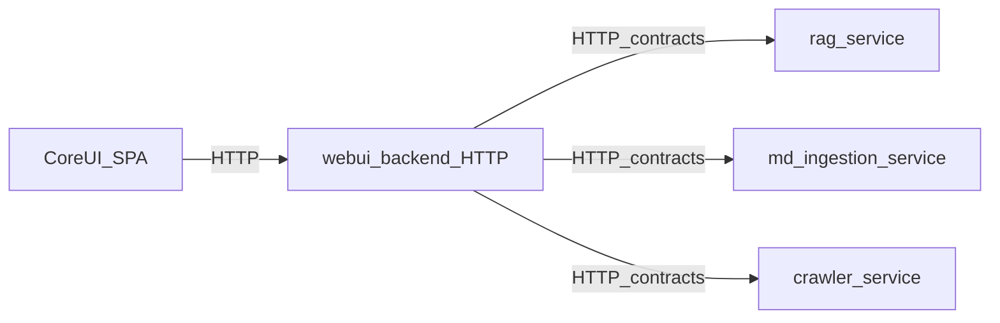

# AI_RULES — working with the ChironAI repository

For humans and AI assistants: terminology, module boundaries, what to keep in sync, and areas to touch only deliberately. Full architecture lives under `docs/`; this file is a cheat sheet with pointers to the source of truth.

---

## 1. Purpose

- **Goal:** quickly locate the Web UI stack, how CoreUI talks to the backend, Python layer boundaries, and the fragile spots.
- **Non-goal:** replace `docs/ARCHITECTURE.md` or per-module READMEs—when in doubt, open the references in section 9.

---

## 2. Project vocabulary (critical)

| Term | What it is |
|------|------------|
| **CoreUI** | React/Vite SPA under `CoreModules/CoreUI/`. Talks to the backend **only over HTTP**—no direct RAG, crawler, or ingestion calls. See `CoreModules/CoreUI/README.md`. |
| **`WebUI/` folder** | Runtime/data directory (`rag_sources`, caches, logs, `last_collection.txt`). This is **not** the frontend and no longer contains Python entrypoints. |
| **WebUIBackend** | Python backend entrypoints and legacy crawl/ingest helpers under `CoreModules/WebUIBackend/webui_backend/`. |
| **Web UI (HTTP API)** | REST under the `/api/webui` prefix for dashboard, settings, logs, etc. **Today** the main route implementation is the monolith `api/http/webui_routes.py`. **Target** migration is the standalone service `modules/webui_backend/`. |
| **Open WebUI** | A separate Docker product; status/start via `CoreModules/ServiceStarter`. Do not conflate with **CoreUI** (our React app) or call it “our WebUI” without qualification. |

Ambiguous “WebUI” in conversation: clarify—**`WebUI/` data folder**, **WebUIBackend**, **`/api/webui` HTTP API**, **CoreUI**, or **Open WebUI**.

---

## 3. CoreUI: how to change the UI

### API and contract

- The **`/api/webui`** prefix must match in three places:
  1. `core/contracts/webui_api.py` — constant `WEBUI_URL_PREFIX`;
  2. `CoreModules/CoreUI/src/services/api.js` — `API_BASE`;
  3. Flask Web UI blueprint — `url_prefix` (today around `api/http/webui_routes.py` and related registration).
- Any new endpoint: update the contract (types/DTOs in `webui_api.py` as needed), the client in `api.js`, and server routes. Otherwise you get **docs ↔ frontend ↔ backend** drift.

### UI Ownership Rule

**CoreUI is the single source of truth for all UI components** (screens, tabs, modals, buttons, inputs, etc.). No other module may introduce its own UI layer, CSS, or component files that would be rendered in the browser.

**Exception:** Extensions may provide their own UI, but ONLY within the Extension's own directory and ONLY through the supported Extension integration points (`tab_ui`, `iframe_tab`, `ui_schema`). Extensions must not inject UI into CoreUI's component tree or styles.

In practice:
- Core code lives in `CoreModules/CoreUI/src/components/`, `styles/`, etc.
- Extensions inject via `iframe_tab` or `ui_schema`; they cannot modify CoreUI internals.
- If a feature needs UI and isn't an Extension, it must be added to CoreUI proper.

### Code layout (as in the repo)

- `CoreModules/CoreUI/src/components/` — screens, tabs, modals.
- `CoreModules/CoreUI/src/services/` — HTTP (`api.js`, `logs.js`, etc.).
- `CoreModules/CoreUI/src/styles/` — global styles, `tokens.css`, per-component CSS under `styles/components/`.
- `CoreModules/CoreUI/src/hooks/`, `utils/`, `constants/` — as named.

`CoreModules/CoreUI/README.md` mentions `src/features/` and `src/shared/`; most of the tree today lives under `components/` and `styles/`. Put new code in existing folders—do not introduce a parallel hierarchy without a reason.

### Design

- Token base: `CoreModules/CoreUI/src/styles/tokens.css` (Material 3: `--md-sys-*`, fonts `--coreui-font-*`).
- Global imports: `CoreModules/CoreUI/src/main.jsx` (`tokens.css`, `coreui-system.css`).
- Primitive pattern: component (e.g. `CoreUIButton.jsx`) + dedicated CSS in `styles/components/`. Prefer tokens and classes over long inline styles where the system is already wired.

### Navigation and loading

- `CoreModules/CoreUI/src/App.jsx`: lazy tab imports and chunk-load retry (`lazyWithRetry`). New tabs should follow the same pattern so deploy UX stays stable.

---

## 4. Extensions

- **Self-containment:** Every extension MUST provide its own UI frame, its own tab title, its own tab icon, and its own assets. Do not rely on CoreUI to provide extension-specific visuals or logic beyond the basic runtime container.
- **Manifest:** Every extension MUST have a `chironai-extension.json` in its root directory defining `id`, `version`, `type`, and `capabilities`.
- **Backend:** Must define a `create_provider(host_context, manifest)` entry point in the configured backend module.
- **UI Integration:** Extensions can provide `tab_ui` (prefer `iframe_tab` for complex UIs) or declarative `ui_schema` for settings/status pages.
- **Docker contract:** Extensions MUST NOT call Docker directly, shell out to Docker, resolve Docker CLI paths, use Docker SDK clients, or call CoreUI routes such as `/api/webui/docker/*`. Extension-owned containers MUST be declared with `DockerContainerSpec` and managed only through `host_context.docker_runtime`.
- **Ollama ownership:** `ollama-provider` is the canonical owner of Ollama provider behavior. Its dedicated extension repository is the source of truth; `extensions/bundled/ollama-provider` is only a trusted bootstrap/offline mirror. Core code should use `LLMRuntime`, provider catalog/actions, or explicitly documented compatibility adapters for public `/api/*` and `/v1/completions` behavior. Do not add new direct `infrastructure.ollama` imports without updating the migration guardrail allowlist and documenting why the import is a temporary compatibility boundary.

---

## 5. Python core (monolith)

Layers (top to bottom): **`api/`** → **`application/`** → **`domain/`** → **`infrastructure/`**, plus `config/`, `utils/`. Details: `docs/ARCHITECTURE.md`.

- **`domain/`** must not import `application`, `api`, or `infrastructure`. Enforcement: **import-linter** in `pyproject.toml` (contract `domain_is_inner_layer`). After changing layer boundaries, run `lint-imports` if your environment is set up for it.
- Web UI responsibility split:
  - **`api/http/service_control.py`** — lifecycle of external services (ServiceStarter, Qdrant, Open WebUI, Ollama, etc.);
  - **`api/http/webui_routes.py`** — HTTP composition for the UI.
  Do not merge them back without a strong reason—this split is intentional for tests and evolution.

---

## 6. Modular target state

Target data flow:

Modules must not import each other's **implementations**—only contracts and HTTP. Shared layer: `core/` (`core/contracts/`, `core/shared/`, `core/config/`). Read: `docs/MODULAR_STRUCTURE.md`, `core/README.md`.

Until migration completes, the monolith (`api/`, `application/`, `domain/`, `infrastructure/`) and new modules coexist; state clearly in commits which path you changed.

---

## 7. High-risk areas

Change carefully; if behavior shifts, document and align with team/repo norms.

1. **LlmProxy / OpenAI compatibility** — `CoreModules/LlmProxy/`: canonical `/v1/chat/completions`, intentional legacy (`/v1/completions` and related). See `docs/ARCHITECTURE.md` (compatibility section), `CoreModules/LlmProxy/README.md`.
2. **Web UI API sync** — `core/contracts/webui_api.py` ↔ `CoreModules/CoreUI/src/services/api.js` ↔ Flask routes.
3. **Settings overlap** — `proxy_settings`, app fields, YAML/env; risk of silent divergence. Key files: `api/http/webui_routes.py`, `api/http/llm_proxy_wiring.py`, `CoreModules/LlmProxy/llm_proxy/chat_completions.py` (see `docs/legacy_map.md`).
4. **Qdrant / retrieval** — multiple modes (dense, hybrid, name compatibility); edits to `CoreModules/RagService/.../qdrant_repository.py` and mirrors under `infrastructure/qdrant/` must stay aligned.
5. **Service control** — `CoreModules/ServiceStarter` and Web UI call paths; keep a single source of truth for ports/status.

Risk and “tail” summary: `docs/legacy_map.md`.

---

## 8. Versioning and Changelog

- **Version Increment:** Every time a task is completed that involves changing at least one file in the project code, the version must be incremented: `X.Y.Z` -> `X.Y.(Z+1)`.
- **Source of Truth:** The canonical version is stored in `core/version.py`.
- **CHANGELOG.md:** Must be updated for every version bump. Use a concise bulleted list to describe **what** was done, but **not how** it was done.

---

## 9. AI checklist before finishing a task

- [ ] If the Web UI API changed: updated `webui_api.py`, `api.js` (and contract types/comments if needed), server routes.
- [ ] No import-boundary violations for `domain/`?
- [ ] If `config/*.yaml` or env vars changed: are they documented for users/deploy?
- [ ] Did you add a new long-lived monolith “tail”—worth a line in `docs/legacy_map.md`?
- [ ] For CoreUI: styles via tokens/existing classes; new tabs via the lazy pattern in `App.jsx`.
- [ ] For Extensions:
    - [ ] Does it provide its own frame, tab title, tab icon, and assets?
    - [ ] Is `chironai-extension.json` present and valid?
    - [ ] Is the `create_provider` entry point implemented?
    - [ ] If it needs Docker, does it use only `host_context.docker_runtime` + `DockerContainerSpec`?
- [ ] **Version bumped and CHANGELOG.md updated?**

---

## 10. Further reading

| Document / module | Purpose |
|-------------------|---------|
| `docs/ARCHITECTURE.md` | Layers, RAG/HTTP/CLI flows, tests, packaging |
| `docs/MODULAR_STRUCTURE.md` | Target modular layout |
| `docs/legacy_map.md` | Current risks and legacy wiring |
| `docs/RAG_BEHAVIOR.md` | RAG behavior (retrieval/prompt work) |
| `CoreModules/CoreUI/README.md` | Running the frontend, `VITE_API_URL` |
| `modules/webui_backend/README.md` | Target Web UI backend |
| `modules/README.md` | Module index |
| `CoreModules/LlmProxy/README.md` | Proxy, endpoints, env |
| `CoreModules/RagService/README.md` | RAG package |
| `CoreModules/ServiceStarter/README.md` | Docker / Ollama / Open WebUI |

---

*File reflects repo state; after large migrations (e.g. extracting `webui_backend`), update sections 2 and 5.*
