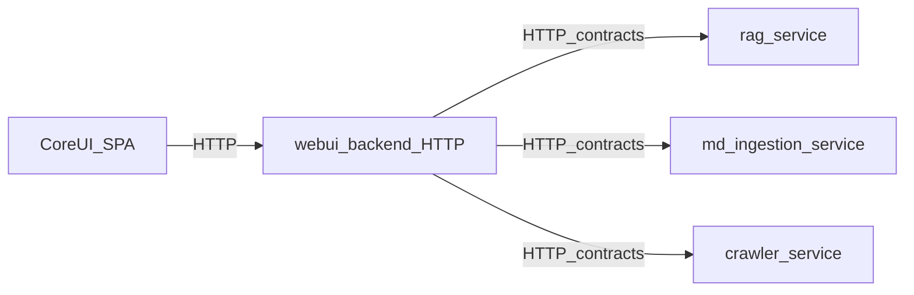

# AI_RULES — working with the ChironAI repository

For humans and AI assistants: terminology, module boundaries, what to keep in sync, and areas to touch only deliberately. Full architecture lives under `docs/`; this file is a cheat sheet with pointers to the source of truth.

---

## 1. Purpose

- **Goal:** quickly locate the Web UI stack, how CoreUI talks to the backend, Python layer boundaries, and the fragile spots.
- **Non-goal:** replace `docs/ARCHITECTURE.md` or per-module READMEs—when in doubt, open the references in section 11.

---

### 1.1 Root ownership rule: no freelance runtime code

Runtime code must not live at the repository root as an unowned "freelancer".
If code is required for startup or product behavior, it must have a documented
owner, purpose, dependency boundary, and verification path.

Allowed ownership buckets:

- **`Core/`** - the application host: composition root, legacy monolith tail,
  host `api/application/domain/infrastructure/config`, shared `core`
  contracts/config package, and host-owned services under `Core/modules/`.
- **`CoreModules/`** - explicit reusable modules/apps that the host depends on
  (`CoreUI`, `LlmProxy`, `RagService`, `DockerManager`, `LogsManager`, etc.).
  Do not use `CoreModules/` as a dumping ground for unrelated host code.
- **`extensions/`** - extension payloads managed through the extension
  contracts and extension-management backend.
- **Project support/runtime data** - `docs/`, `tests/`, `scripts/`, `.github/`,
  `Core/data/webui/`, `logs/`, `tmp/`, and config files, when they are not importable
  runtime packages.

Root-level runtime packages are forbidden unless explicitly allowlisted as migration
tails. Host-owned packages and services live under `Core/` and `Core/modules/`.

Automated guardrail: `scripts/root_layout_guard.py` and
`tests/scripts/test_root_layout_guard.py` reject new top-level directories until
they are classified in the root ownership allowlist.

Current root directory ownership:

| Root folder | Owner | Classification |
|-------------|-------|----------------|
| `.agents/` | project support | agent metadata |
| `.cursor/` | project support | editor metadata |
| `.git/` | project support | VCS metadata |
| `.github/` | project support | CI metadata |
| `.hypothesis/` | project support | tool cache |
| `.import_linter_cache/` | project support | tool cache |
| `.kilo/` | project support | agent metadata |
| `.mypy_cache/` | project support | tool cache |
| `.ruff_cache/` | project support | tool cache |
| `.tmp_openwebui_data/` | temporary | local runtime data |
| `.tmp_test_local/` | temporary | local test data |
| `.vscode/` | project support | editor metadata |
| `chironai.egg-info/` | project support | packaging metadata |
| `Core/` | Core | application host container |
| `CoreModules/` | CoreModules | reusable modules and applications |
| `docs/` | project support | architecture and runbooks |
| `extensions/` | extensions | extension payloads |
| `logs/` | runtime data | local logs and databases |
| `rag_tests/` | project support | RAG evaluation fixtures |
| `reports/` | project support | generated reports |
| `scripts/` | project support | repo tooling |
| `tests/` | project support | test suite |
| `tmp/` | temporary | scratch and cloned dependency worktrees |

When deciding where code belongs:

- Put host composition, app-specific adapters, compatibility shims, shared
  contracts/config, and legacy monolith tails under `Core/`.
- Put only named reusable modules with clear public responsibility under
  `CoreModules/`.
- Keep CoreUI source in `CoreModules/CoreUI` unless the UI is extension-owned
  and uses supported extension integration points.
- Do not leave code in the root merely because "the app needs it"; that is the
  smell this rule exists to remove.

---

## 2. Project vocabulary (critical)

**Core** is the target application host container under `Core/`: composition
root, host layers, shared `core` package, and host-owned modules. During
migration, some host folders may still exist at the repository root, but they
are migration tails rather than permanent freelance packages.

| Term | What it is |
|------|------------|
| **CoreUI** | React/Vite SPA under `CoreModules/CoreUI/`. Talks to the backend **only over HTTP**—no direct RAG, crawler, or ingestion calls. See `CoreModules/CoreUI/README.md`. |
| **`Core/data/webui/`** | Host-owned runtime/data directory (`rag_sources`, caches, `last_collection.txt`). This is **not** the frontend and no longer lives at the repository root. |
| **WebUIBackend** | Canonical Python backend package under `Core/modules/webui_backend/webui_backend/`; owns WebUI entrypoints plus legacy crawl/ingest helpers that have not yet been extracted further. |
| **Web UI (HTTP API)** | REST under the `/api/webui` prefix for dashboard, settings, logs, etc. The canonical package is `webui_backend`; the remaining route-composition tail is in the host API layer (`Core/api/http/...`, import name `api.http...`). |
| **Open WebUI** | A separate Docker product; status/start is owned by the `open-webui` extension through DockerManager host capabilities. Do not conflate with **CoreUI** (our React app) or call it “our WebUI” without qualification. |

Ambiguous “WebUI” in conversation: clarify—**`Core/data/webui/` data folder**, **WebUIBackend**, **`/api/webui` HTTP API**, **CoreUI**, or **Open WebUI**.

---

Host-owned services live under `Core/modules/` with stable import names, not
automatic promotion into `CoreModules/`.

## 3. CoreUI: how to change the UI

### API and contract

- The **`/api/webui`** prefix must match in four places:
  1. `Core/core/contracts/webui_api.py` — constant `WEBUI_URL_PREFIX`;
  2. `CoreModules/CoreUI/src/services/api.js` — `API_BASE`;
  3. Flask Web UI blueprint — `url_prefix` (today around `Core/api/http/webui_routes.py` and related registration).
  4. RESTX/OpenAPI documentation — the generated spec and Swagger UI exposed through `/api/webui/openapi.json` and `/api/webui/swagger/`.
- Any new endpoint: update the contract (types/DTOs in `webui_api.py` as needed), the client in `api.js`, server routes, and RESTX/OpenAPI descriptions/models/tests. Otherwise you get **docs ↔ frontend ↔ backend** drift.

### Removal cleanup

- When removing UI or API surface, clean the entire tail in the same change: imports, exports, routes, route registration, service/client methods, constants, tests, styles, CoreUI Showcase entries, docs, and checklist references. Do not leave dead code, stale navigation, unused CSS, orphaned tests, or documented features that no longer exist.

### UI Ownership Rule

**CoreUI is the single source of truth for all UI components** (screens, tabs, modals, buttons, inputs, etc.). No other module may introduce its own UI layer, CSS, or component files that would be rendered in the browser.

**Exception:** Extensions may provide their own UI, but ONLY within the Extension's own directory and ONLY through the supported Extension integration points (`tab_ui`, `iframe_tab`, `ui_schema`). Extensions must not inject UI into CoreUI's component tree or styles.

In practice:
- Core code lives in `CoreModules/CoreUI/src/components/`, `styles/`, etc.
- Extensions inject via `iframe_tab` or `ui_schema`; they cannot modify CoreUI internals.
- If a feature needs UI and isn't an Extension, it must be added to CoreUI proper.

### UI reuse rule

- If a view, screen fragment, modal, control group, or visual pattern can be unified with an existing CoreUI implementation, it MUST be unified and reused. Do not hardcode a second implementation of the same view or pattern; duplicate UI implementations are not accepted.

### Tabs and subtabs

- For tab + subtab hierarchies, use CoreUI's shared tab components instead of feature-local tab markup/styles.
- Use `CoreUIPillTabs` for primary tabs, section tabs, and mode switchers that sit outside cards.
- Use `CoreUISubtabs` for secondary/subtab navigation inside cards, panels, and compact in-card sections.
- Do not put `CoreUIPillTabs` inside cards for subtabs; if the navigation is visually contained by a card, it should usually be `CoreUISubtabs`.

### CoreUI Showcase sync

- When adding or removing reusable CoreUI components, visual patterns, screens, tabs, modals, or other browser-rendered UI, update `CoreModules/CoreUI/src/components/CoreUIShowcaseTab.jsx` in the same change: add the matching showcase view/example for new UI, or remove the obsolete showcase view/example for deleted UI.

### CoreUI JSX validation

- After changing CoreUI `.jsx`, `.tsx`, `.js`, or `.ts` files that are rendered by Vite/React, run the CoreUI production build or an equivalent parser/lint check before finishing. This specifically guards against malformed JSX such as stray template literals, duplicated `className` fragments, or accidental text inserted between an opening tag and its children.
- If the check cannot be run, the final response must say so explicitly and include the reason. Do not finish UI code changes without either a successful check or a clearly reported verification gap.

### CoreUI bundle budget and unit tests

- The CoreUI JavaScript bundle has a tracked budget enforced by `npm run bundle:budget` in `scripts/quality_gate.py`. If your change grows the bundle, you must either:
  1. Split the new code into a lazy-loaded chunk.
  2. Remove accidental non-lazy imports in `App.jsx` or shared entry points.
  3. Intentionally bump the budget baseline with a justification in `CHANGELOG.md` and a comment in `CoreModules/CoreUI/scripts/bundle_budget.mjs`.
- Do not let the budget drift silently; gate failures here block the release profile.
- Run `npm run test:run` and `npm run test:coverage` after any CoreUI change that affects components, hooks, or services. A single failing React test currently blocks `coreui-test` and `coreui-coverage` in the full/release gate.

### Code layout (as in the repo)

- `CoreModules/CoreUI/src/components/` — screens, tabs, modals.
- `CoreModules/CoreUI/src/services/` — HTTP (`api.js`, `logs.js`, etc.).
- `CoreModules/CoreUI/src/styles/` — global styles, `tokens.css`, per-component CSS under `styles/components/`.
- `CoreModules/CoreUI/src/hooks/`, `utils/`, `constants/` — as named.

`CoreModules/CoreUI/README.md` mentions `src/features/` and `src/shared/`; most of the tree today lives under `components/` and `styles/`. Put new code in existing folders—do not introduce a parallel hierarchy without a reason.

### Design

- Token base: `CoreModules/CoreUI/src/styles/tokens.css` (Material 3: `--md-sys-*`, fonts `--coreui-font-*`).
- Global imports: `CoreModules/CoreUI/src/main.jsx` (`tokens.css`, `coreui-system.css`).
- Primitive pattern: component (e.g. `CoreUIButton.jsx`) + dedicated CSS in `styles/components/`. Prefer tokens and classes over long inline styles where the system is already wired.

### Navigation and loading

- `CoreModules/CoreUI/src/App.jsx`: lazy tab imports and chunk-load retry (`lazyWithRetry`). New tabs should follow the same pattern so deploy UX stays stable.

---

## 4. Extensions

- **Self-containment:** Every extension MUST provide its own UI frame, its own tab title, its own tab icon, and its own assets. Do not rely on CoreUI to provide extension-specific visuals or logic beyond the basic runtime container.
- **Manifest:** Every extension MUST have a `chironai-extension.json` in its root directory defining `id`, `version`, `type`, and `capabilities`.
- **Backend:** Must define a `create_provider(host_context, manifest)` entry point in the configured backend module.
- **UI Integration:** Extensions can provide `tab_ui` (prefer `iframe_tab` for complex UIs) or declarative `ui_schema` for settings/status pages.
- **Docker contract:** Extensions MUST NOT call Docker directly, shell out to Docker, resolve Docker CLI paths, use Docker SDK clients, or call CoreUI routes such as `/api/webui/docker/*`. Extension-owned containers MUST be declared with `DockerContainerSpec` and managed only through `host_context.docker_runtime`.
- **Ollama ownership:** `ollama-provider` is the canonical owner of Ollama provider behavior. Its dedicated extension repository is the source of truth; `extensions/bundled/ollama-provider` is only a trusted bootstrap/offline mirror. Core code should use `LLMRuntime`, provider catalog/actions, or explicitly documented compatibility adapters for public `/api/*` and `/v1/completions` behavior. Do not add `from infrastructure.ollama` imports (guardrail: `tests/application/test_ollama_migration_guardrails.py`).

---

## 5. Python core (monolith)

Layers (top to bottom): **`Core/api/`** → **`Core/application/`** → **`Core/domain/`** → **`Core/infrastructure/`**, plus `Core/config/`. Import names remain `api`, `application`, `domain`, `infrastructure`, and `config`. Details: `docs/ARCHITECTURE.md`.

- **`Core/domain/`** must not import `application`, `api`, or `infrastructure`. Enforcement: **import-linter** in `pyproject.toml` (contract `domain_is_inner_layer`). After changing layer boundaries, run `lint-imports` if your environment is set up for it.
- Web UI responsibility split:
  - **`Core/api/http/service_control.py`** — lifecycle bridge for WebUI service actions; Qdrant delegates to `RagRuntime`, while extension-owned services use DockerManager host capabilities.
  - **`Core/api/http/webui_routes.py`** — HTTP composition for the UI.
  Do not merge them back without a strong reason—this split is intentional for tests and evolution.

### 5.1 Exception handling hygiene

- Avoid bare or overly broad `except Exception:` in new code. Catch the specific exception types the call site can reasonably produce (`requests.RequestException`, `subprocess.SubprocessError`, `ValueError`, `KeyError`, `FileNotFoundError`, etc.).
- If you must catch `Exception` (e.g., compatibility shims, teardown, defensive runtime probes), add a `# nosec` comment with a one-line justification and log the exception at `warning` or `error` level. Do not swallow silently.
- When refactoring existing broad catches, preserve observable behavior: if the original code returned a fallback dict or `None`, keep that contract and add a test for the error path.
- Use `scripts/audit_silent_exceptions.py` (advisory) to find candidates for narrowing.

### 5.2 LogsManager (internal LLM only)

- **Purpose:** debug RAG Fusion proxy requests from Cursor agents and internal repo scripts.
- **Not a public API:** do not add `/api/webui` routes or CoreUI surfaces for LogsManager.
- **Data scope:** persisted **RAG Fusion Journal** rows only (`session_id='proxy'`, `source='proxy'`, `level='INFO'` in `logs/webui.db`). Completed requests include full trace data in `metadata.trace`.
- **Install:** `pip install -e CoreModules/LogsManager` (included in `requirements-dev.txt`).
- **Usage:**

```python
from logs_manager import get_logs_manager

mgr = get_logs_manager()

latest = mgr.get_latest_log()
by_id = mgr.get_log_by_id(18561)
matched = mgr.find_latest_log_with_user_message("Найди")
```

- **When to use which method:**
  - last proxy request → `get_latest_log()`
  - known journal id → `get_log_by_id()`
  - find a recent request by prompt fragment → `find_latest_log_with_user_message()` (Unicode case-insensitive substring match on user text)
- **Fields to inspect:** `metadata.user_query`, `metadata.response_preview`, `metadata.trace`, `metadata.trace_id`, `metadata.rag_steps`, `metadata.rag_context`.
- **Limitation:** `user_query` is truncated to 500 characters when persisted.
- **Live traces:** in-memory snapshots from `Core/api/http/proxy_trace.py` are out of scope; use `recent_proxy_traces()` for active requests. LogsManager reads the persisted journal only.
- **Details:** `CoreModules/LogsManager/README.md`.

---

## 6. Modular target state

Root-cleanup target: host-owned top-level runtime folders move under `Core/`,
while `CoreModules/` remains the place for explicit reusable modules/apps. Do
not treat root cleanup as permission to move all host code into `CoreModules/`.

Target data flow:



Modules must not import each other's **implementations**—only contracts and HTTP. Shared layer: `Core/core/` (`core/contracts/`, `core/shared/`, `core/config/`). Read: `docs/MODULAR_STRUCTURE.md`, `Core/core/README.md`.

Until migration completes, the host monolith under `Core/` and new modules coexist; state clearly in commits which path you changed.

---

## 7. High-risk areas

Change carefully; if behavior shifts, document and align with team/repo norms.

1. **LlmProxy / OpenAI compatibility** — `CoreModules/LlmProxy/`: canonical `/v1/chat/completions`, intentional legacy (`/v1/completions` and related). See `docs/ARCHITECTURE.md` (compatibility section), `CoreModules/LlmProxy/README.md`.
2. **Web UI API sync** — `Core/core/contracts/webui_api.py` ↔ `CoreModules/CoreUI/src/services/api.js` ↔ Flask routes.
3. **Settings overlap** — `proxy_settings`, app fields, YAML/env; risk of silent divergence. Key files: `Core/api/http/webui_routes.py`, `Core/api/http/llm_proxy_wiring.py`, `CoreModules/LlmProxy/llm_proxy/chat_completions.py` (see `docs/legacy_map.md`).
4. **Qdrant / retrieval** — multiple modes (dense, hybrid, name compatibility); edits to `CoreModules/RagService/.../qdrant_repository.py` and mirrors under `Core/infrastructure/qdrant/` must stay aligned.
5. **Service control** — Qdrant Web UI call paths delegate to `CoreModules/RagService`; extension service actions must use DockerManager host capabilities.

6. **WebUI LAN exposure** — sensitive management routes under `/api/webui/llm-proxy/*` and similar must not assume the client is local. When the server is bound to `0.0.0.0`, any reachable client can read proxy status/builds. Add loopback or API-key guards for sensitive read endpoints; add tests for both loopback and non-loopback clients.

Risk and “tail” summary: `docs/legacy_map.md`.

---

## 8. Versioning and Changelog

- **Version Increment:** Every time a task is completed that involves changing at least one file in the project code, the version must be incremented: `X.Y.Z` -> `X.Y.(Z+1)`.
- **Source of Truth:** The canonical version is stored in `Core/core/version.py`.
- **CHANGELOG.md:** Must be updated for every version bump. Use a concise bulleted list to describe **what** was done, but **not how** it was done.

### Release gate verification

- Before claiming that a release is ready, run `python scripts/quality_gate.py --profile release` on the primary development environment (Windows 11 + Docker Desktop). Do not rely only on `minimal` or `full`.
- If the release gate fails, capture the failing step names and either fix them or update `Pre-Release.md` / `RELEASE.md` with an accurate "Known gaps" section. Do not let release documentation claim a green gate while it is red.
- For CoreUI-only changes, at minimum run the CoreUI subset: `npm run build`, `npm run bundle:budget`, `npm run test:run`, `npm run test:coverage`, `npm run lint`, `npm run typecheck`.

### Runtime smoke check

- After every task that changes any non-`.md` file, verify that the application starts via [`build_and_run.bat`](build_and_run.bat).
- If `build_and_run.bat` cannot be run or fails, state that explicitly in the final response with the reason and any relevant error summary.

---

## 9. AI checklist before finishing a task

- [ ] If the Web UI API changed: updated `webui_api.py`, `api.js` (and contract types/comments if needed), server routes.
- [ ] If any HTTP endpoint was added, changed, or removed: updated RESTX/OpenAPI documentation/models and spec coverage tests.
- [ ] If UI/API was removed: imports, routes/registration, client methods, constants, tests, styles, CoreUI Showcase, and docs cleaned up.
- [ ] No import-boundary violations for `domain/`?
- [ ] If `config/*.yaml` or env vars changed: are they documented for users/deploy?
- [ ] Did you add a new long-lived monolith “tail”—worth a line in `docs/legacy_map.md`?
- [ ] For CoreUI: styles via tokens/existing classes; new tabs via the lazy pattern in `App.jsx`; tab/subtab hierarchy uses `CoreUIPillTabs` outside cards and `CoreUISubtabs` inside cards; reusable views unified instead of duplicated; CoreUI Showcase updated when UI was added or removed.
- [ ] If CoreUI React/Vite source changed: production build or equivalent JSX/parser/lint check passed, or the final response explains why it was not run.
- [ ] If any non-`.md` file changed: application startup verified through [`build_and_run.bat`](build_and_run.bat), or the final response explains why it was not verified.
- [ ] For Extensions:
    - [ ] Does it provide its own frame, tab title, tab icon, and assets?
    - [ ] Is `chironai-extension.json` present and valid?
    - [ ] Is the `create_provider` entry point implemented?
    - [ ] If it needs Docker, does it use only `host_context.docker_runtime` + `DockerContainerSpec`?
- [ ] **Version bumped and CHANGELOG.md updated?**
- [ ] If the change touches broad `except Exception:` blocks: are they narrowed to specific exceptions with tests for the error path?
- [ ] If the change affects CoreUI: does `npm run bundle:budget` still pass, and do `npm run test:run` / `npm run test:coverage` pass?
- [ ] If the change adds or exposes a sensitive WebUI route: is it protected when the server binds to non-loopback addresses?
- [ ] If the change is dual-client (loopback + LAN/remote): did you verify **both** user-story paths and avoid loopback UI stubs? (§10.4)
- [ ] If the task closes a tech-debt item: is `TECH_DEBT_TODO.md` updated (status, notes, new items discovered)?

---

## 10. Technical debt and AI agent workflow

### 10.1 `TECH_DEBT_TODO.md` is the local backlog

- `TECH_DEBT_TODO.md` is a scratchpad for known technical debt. It is in `.gitignore` and must not be committed.
- Before starting a non-trivial task, read it to see if your change overlaps with an open debt item.
- After closing a debt item, update its status and add a short note about what changed.
- If your work reveals new debt, add it to the backlog with a priority, acceptance criteria, and file references.

### 10.2 How to close tech-debt tasks

1. **Read the linked files and adjacent tests first.** Do not change code without understanding the current contract.
2. **Start with the smallest verifiable step.** For example, fix one failing CoreUI test before refactoring the whole tab.
3. **Run the relevant gate subset before finishing.** Do not rely on "it should work"; run the actual command.
4. **Preserve contracts.** If a route, function, or file is public (imported by tests or other modules), keep its signature or add a compatibility shim with a deprecation note.
5. **Document intentional trade-offs.** If you bump a bundle budget, widen an exception catch, or skip a migration, explain why in code comments and `CHANGELOG.md`.
6. **Update metrics.** After broad-exception cleanup or module split, update the count in `TECH_DEBT_TODO.md`.

### 10.3 Priority conventions

- **P0** — blocks release gate or has security impact. Fix before claiming the task done.
- **P1** — breaks tooling or erodes trust in gates. Fix in the same sprint.
- **P2** — slows development but has a workaround. Schedule explicitly.
- **P3** — polish. Pick up opportunistically.

### 10.4 Dual-client UI and security features (loopback + remote)

Applies when a spec describes **two clients** (e.g. admin on `127.0.0.1`, consumer on LAN) or when routes use `webui_trusted_client` / loopback guards.

1. **Read the user story first.** List numbered steps for **each** client before coding. If the spec says "install on localhost, use from Mac", localhost is not optional.
2. **`loopback-only` mutations ≠ skip reads on loopback.** If `GET` returns public metadata (status, configured flags), the loopback UI must call it like any other client. Do not hardcode `{ configured: false }` or similar stubs in `refresh*` helpers unless the maintainer explicitly approved it in the task.
3. **No self-rationalized shortcuts.** Do not mark a task done because "remote path works" while localhost admin UI is broken or stuck in one state.
4. **Tests must match the state machine.** A smoke test that only asserts a heading rendered is **not** acceptance for new cards, modals, or button visibility that depends on API status. Add at least one behavioral unit test per distinct UI state (e.g. PIN not configured → Install; PIN configured → Change + Disable).
5. **End-of-task report must include:**

   ```text
   User story verified: yes / no
   Steps: (copy from spec; mark pass/fail each)
   ```

   If any step fails, status is **not done** — use `[!]` in `TECH_DEBT_TODO.md`, not `[x]`.

6. **Maintainer decision records** (e.g. `WebUI_LAN_AUTH.md`, `.gitignore`): read before implementing security UX; do not expand scope (full LAN auth, DB encryption) unless the maintainer reopens it.

**Anti-pattern (reject in review):**

```javascript
if (isLoopback) {
  setPinStatus({ configured: false, locked_out: false });
  return;
}
```

When the backend exposes `GET …/status` and localhost is where admins install/configure the feature.

---

## 11. Further reading

| Document / module | Purpose |
|-------------------|---------|
| `docs/ARCHITECTURE.md` | Layers, RAG/HTTP/CLI flows, tests, packaging |
| `docs/MODULAR_STRUCTURE.md` | Target modular layout |
| `docs/legacy_map.md` | Current risks and legacy wiring |
| `docs/RAG_BEHAVIOR.md` | RAG behavior (retrieval/prompt work) |
| `CoreModules/CoreUI/README.md` | Running the frontend, `VITE_API_URL` |
| `Core/modules/webui_backend/README.md` | Canonical Web UI backend |
| `Core/modules/README.md` | Host-owned module index |
| `Core/modules/prompts_manager/README.md` | RAG prompt template ownership |
| `CoreModules/LlmProxy/README.md` | Proxy, endpoints, env |
| `CoreModules/LogsManager/README.md` | Internal proxy journal reader for LLM agents |
| `CoreModules/RagService/README.md` | RAG package |

---

*File reflects repo state; after large Web UI route extractions, update sections 2 and 5.*
