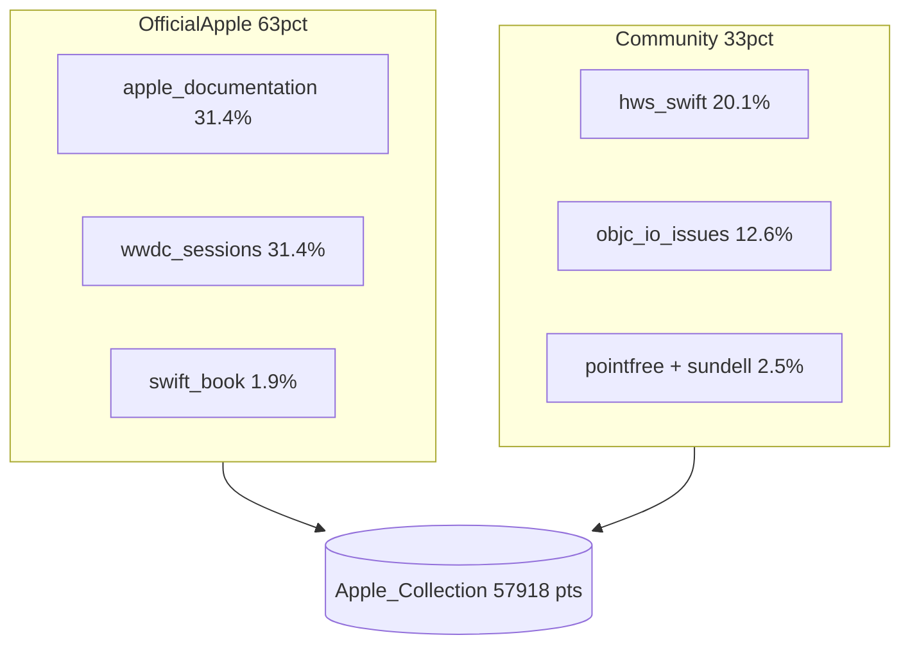
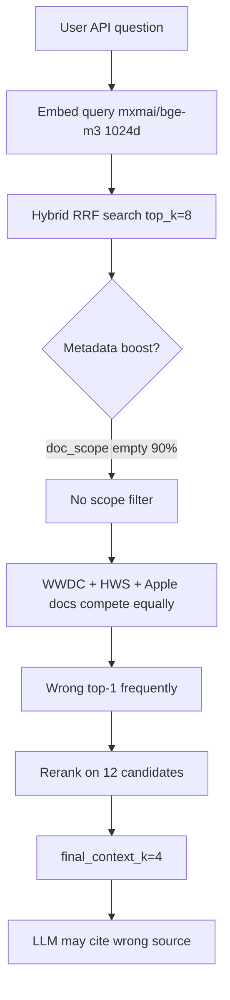
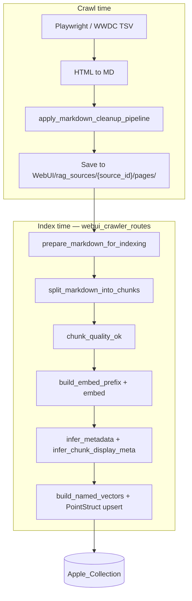
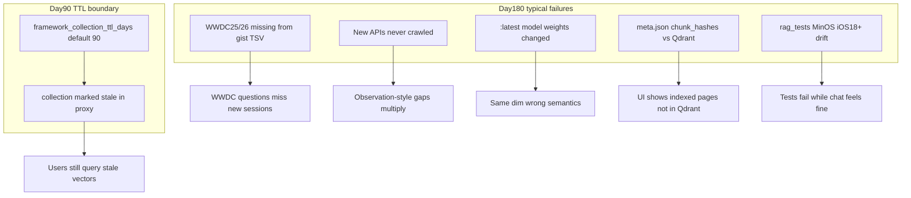
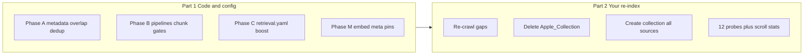

# Apple_Collection — Quality Audit Report

**Date:** 2026-05-31  
**Collection:** `Apple_Collection` (Qdrant `http://localhost:6333`)  
**Default config:** `config/server.yaml` → `qdrant.collection_name: "Apple_Collection"`  
**Audit type:** Live readonly inspection (full scroll + 12 retrieval probes)  
**Audience:** Human operators and AI agents maintaining RAG quality  
**Re-index status:** **Part 1 (code/config) largely complete** — you run **Part 2 (re-crawl + full re-index + verification)** when ready. See [Workflow: implementation first](#workflow-implementation-first-then-re-index).  
**Maintenance horizon:** See [Six-month decay forecast](#six-month-decay-forecast-what-breaks-without-action) — several subsystems degrade before 180 days even after a perfect re-index.

---

## Executive Summary

**Overall weighted score: 71 / 100**

`Apple_Collection` is a **technically healthy hybrid vector index** (57 918 points, dense+sparse, payload keyword indexes, Qdrant status `green`). It is **not yet optimized for authoritative Apple Developer Documentation retrieval**. Community guides (Hacking with Swift), WWDC transcripts, and objc.io articles compete on equal footing with `developer.apple.com` pages. Metadata fields that power intent-aware retrieval (`doc_scope`, `framework`, `symbol`) are sparsely populated. Exact-text duplicates consume ~14% of storage and pollute top-k pools.

**Verdict in plain language:** The collection works as a broad Swift/iOS knowledge base, but when a user asks an API question ("What is `@Observable`?", "How does `NavigationStack` work?"), RAG often surfaces WWDC talk transcripts or unrelated API symbols instead of the official documentation page. Fixing this does not require replacing Qdrant — it requires metadata enrichment, source balancing, deduplication, and retrieval tuning.

**Longevity warning:** Even after a successful re-index, the stack expects **quarterly maintenance**, not set-and-forget. Default collection TTL is **90 days** (`framework_collection_ttl_days`). Without crawl/index refresh, WWDC coverage, embed-model lineage, and crawl↔Qdrant bookkeeping drift within **6 months** — see [Six-month decay forecast](#six-month-decay-forecast-what-breaks-without-action).

### Score table (0–100)

| # | Criterion | Weight | Score | Status |
|---|-----------|--------|-------|--------|
| 1 | Schema & Qdrant compatibility | 10% | **92** | Good |
| 2 | Embedding dimensional alignment | 5% | **82** | Good (model lineage unverified) |
| 3 | Operational health | 5% | **95** | Excellent |
| 4 | Coverage & volume | 5% | **78** | Good |
| 5 | Source authority balance | 5% | **63** | Needs work |
| 6 | Payload metadata completeness | 20% | **52** | Poor |
| 7 | Chunking quality | 15% | **72** | Acceptable |
| 8 | Deduplication | 10% | **62** | Needs work |
| 9 | Hybrid index utilization | 5% | **88** | Good |
| 10 | Retrieval relevance (12 probes) | 25% | **48** | Poor |
| 11 | RAG pipeline config alignment | 5% | **55** | Underutilized |
| 12 | Test harness readiness | 5% | **70** | Acceptable |
| | **Weighted overall** | **100%** | **71** | |

**Pass thresholds for re-audit:**

| Tier | Overall | Retrieval | Metadata |
|------|---------|-----------|----------|
| Minimum acceptable | ≥ 75 | ≥ 65 | ≥ 70 |
| Target | ≥ 85 | ≥ 80 | ≥ 85 |
| Excellent | ≥ 92 | ≥ 90 | ≥ 92 |

---

## Collection snapshot

### Infrastructure

| Field | Value |
|-------|-------|
| Qdrant status | `green` |
| Optimizer | `ok` |
| Points count | **57 918** |
| Indexed vectors | **114 815** (~2× points → hybrid dense + sparse) |
| Segments | 8 |
| Write queue | 0 |
| On-disk payload | `true` |
| Dense vector | name `dense`, **1024 dimensions**, distance **Cosine** |
| Sparse vector | name `sparse` (present, used in hybrid RRF query) |
| HNSW | m=16, ef_construct=100 |

### Payload keyword indexes (all 57 918 points indexed)

`language`, `technology`, `domain`, `product`, `doc_type`, `doc_scope`, `framework`, `section`, `symbol`

These indexes exist and are usable for Qdrant filters — but many fields carry empty or generic values (see Metadata section).

### Embedding model at audit time

| Context | Model | Dimensions |
|---------|-------|------------|
| Probe queries (resolved via `get_ollama_embed_model()`) | `mxbai-embed-large` | 1024 |
| `config/models.yaml` default | `bge-m3:latest` | 1024 |
| Collection dense vector size | — | 1024 |

Both configured models produce 1024-dim vectors, so dimension mismatch is not the primary issue. **Risk:** if indexing used a different model than query-time embedding, semantic drift is possible. The collection stores no `embed_model` or `indexed_at` metadata to verify lineage.

---

## Source mix



### Source distribution (full scroll, n = 57 918)

| Source ID | Points | Share |
|-----------|--------|-------|
| `apple_documentation` | 18 208 | 31.4% |
| `wwdc_sessions_2019_plus` | 18 179 | 31.4% |
| `hws_swift` | 11 653 | 20.1% |
| `objc_io_issues` | 7 315 | 12.6% |
| `swift_book` | 1 095 | 1.9% |
| `pointfree_collections` | 1 124 | 1.9% |
| `swiftbysundell_articles` | 344 | 0.6% |

**Interpretation:** Official Apple Developer Documentation is only **one third** of the index. WWDC transcripts match it in volume. Community tutorials (HWS + objc.io) are **one third** combined. For API-symbol questions, this balance causes non-authoritative sources to win vector similarity ties.

Configured sources: `config/sources.yaml` (7 active source IDs above).

---

## Deep dive by criterion

### 1. Schema & Qdrant compatibility — 92/100

**What we measured:** `GET /collections/Apple_Collection`, comparison with `CoreModules/RagService/docs/QDRANT_VECTOR_MODES.md`.

**Facts:**
- Named vectors `dense` + `sparse` — required by `QdrantRagRepository`.
- Hybrid query via `POST .../points/query` with RRF fusion works.
- Payload schema has keyword indexes on all filter fields used by RAG intent logic.
- Status `green`, optimizer healthy.

**Why it matters:** Schema mismatch would break retrieval entirely. This collection is correctly shaped for the current RAG stack.

**Gaps (−8):** No quantization config; no collection-level versioning field; `indexed_vectors_count` (114 815) > `points_count` (57 918) confirms hybrid but doubles index storage cost.

**Re-audit pass:** Score ≥ 90 if status stays `green` and vector names remain `dense`/`sparse`.

---

### 2. Embedding dimensional alignment — 82/100

**What we measured:** Collection `dense.size` vs Ollama embed output dim at probe time.

**Facts:**
- Collection: 1024 dim Cosine.
- Probe embed model: `mxbai-embed-large` → 1024 dim.
- Config YAML lists `bge-m3:latest` as primary embed model (also 1024 dim).

**Why it matters:** Dimension mismatch causes hard retrieval failure. Same-dimension different-model still causes semantic drift.

**Gaps (−18):** No persisted record of which model built the index. Env override (`RAG_EMBED_MODEL`) may differ from index-time model. Recommend storing `embed_model` + `indexed_at` in WebUI collection meta after each re-index.

**Re-audit pass:** Score ≥ 90 when index and query models are documented and identical.

---

### 3. Operational health — 95/100

**Facts:**
- Status: `green`
- Optimizer: `ok`
- Segments: 8
- Update queue length: 0
- On-disk payload: enabled (good for 57k+ points)

**Re-audit pass:** Score ≥ 90 if status remains `green` and queue stays 0 after bulk re-index.

---

### 4. Coverage & volume — 78/100

**Facts:**
- 57 918 chunks across 7 sources — substantial for local RAG.
- 36 distinct `framework` values in payload (SwiftUI 3049, UIKit 1888, Swift 1720, …).
- `apple_documentation` seed URLs in `config/sources.yaml` cover 40+ Apple frameworks (SwiftUI, UIKit, visionOS, StoreKit, …).

**Gaps (−22):**
- `apple_documentation` crawl `max_depth: 3` may miss deep symbol trees.
- Only 5 346 points (9.2%) carry `symbol` — API coverage is thin relative to Apple's full catalog.
- `swift_book` underrepresented (1.9%) despite rich language-guide content in sources config.

**Re-audit pass:** Score ≥ 85 when `apple_documentation` ≥ 40% of points OR dedicated `Apple_Official` collection exists with ≥ 25k points.

---

### 5. Source authority balance — 63/100

**Facts:**
- Official (`apple_documentation` + `swift_book`): **33.3%**
- WWDC transcripts: **31.4%**
- Community (HWS, objc.io, pointfree, sundell): **35.3%**

**Why it matters:** For questions expecting `developer.apple.com` citations, community and WWDC content creates noise. WWDC is valuable for "what's new" questions but harmful when it outranks API reference for symbol lookups.

**Evidence from probes:** 7 of 12 probes failed to place `apple_documentation` at rank 1; 4 had no `apple_documentation` in top 5 at all.

**Re-audit pass:** Score ≥ 75 when ≥ 6/12 API-doc probes return `apple_documentation` at rank 1.

---

### 6. Payload metadata completeness — 52/100

**Full-scroll field population (n = 57 918):**

| Field | Populated | Share | Notes |
|-------|-----------|-------|-------|
| `source`, `url`, `path`, `text`, `chunk_id` | 57 918 | 100% | Core fields complete |
| `doc_type` | 57 918 | 100% | Always set (inferred) |
| `domain`, `language`, `technology`, `product` | 57 918 | 100% | Always set |
| `section` | 56 842 | 98.1% | Good |
| `token_count` | 57 918 | 100% | Good |
| `framework` | 16 511 | **28.5%** | Missing on 71.5% |
| `symbol` | 5 346 | **9.2%** | Critical for API intent filters |
| `doc_scope` | 5 826 | **10.1%** | **89.9% empty** |

**`doc_scope` breakdown:**

| Value | Points | Share |
|-------|--------|-------|
| `<empty>` | 52 092 | 89.9% |
| `api_symbol` | 4 339 | 7.5% |
| `guide` | 1 473 | 2.5% |
| `tutorial` | 14 | 0.0% |

**`doc_type` breakdown:**

| doc_type | Points | Share |
|----------|--------|-------|
| `howto` | 20 326 | 35.1% |
| `conceptual` | 12 034 | 20.8% |
| `wwdc_session` | 11 742 | 20.3% |
| `documentation` | 9 200 | 15.9% |
| `api_ref` | 4 444 | 7.7% |

**`domain` breakdown:**

| domain | Points |
|--------|--------|
| `framework_guide` | 33 556 |
| `community_guide` | 18 780 |
| `language_guide` | 3 269 |

**Problematic `section` values (noise from community sources):**

| section slug | Count | Source pattern |
|--------------|-------|----------------|
| `similar_solutions…` | 1 341 | HWS navigation boilerplate |
| `[___twitter_](https://twitter.com/twostraws)` | 1 270 | HWS author footer |
| `[___sponsor_the_site_](/sponsor)` | 1 138 | HWS sponsor CTA |
| `about_the_swift_knowledge_base` | 642 | HWS meta |

**Apple docs without `framework`:** 1 697 of 18 208 (9.3%) — URLs outside known framework prefixes in `metadata_inference.py`.

**Why it matters:** `docs/RAG_BEHAVIOR.md` describes intent filters on `payload.symbol`, `payload.framework`, `payload.section`, and `doc_scope` weights in `config/retrieval.yaml`. With 90% empty `doc_scope`, `doc_scope_weight` and `doc_type_weight` barely affect ranking.

**Root cause (code):** `infer_metadata()` in `CoreModules/RagService/rag_service/domain/services/metadata_inference.py` sets `doc_scope` only when URL contains `guide`/`tutorial` or section_path looks like an API symbol name with parentheses. Most Apple doc chunks have section slugs like `discussion`, `return_value` — these do not map to `doc_scope`.

**Re-audit pass:** Score ≥ 70 when `doc_scope` non-empty ≥ 60%; score ≥ 85 when `symbol` ≥ 25% on `apple_documentation` points.

---

### 7. Chunking quality — 72/100

**Config reference:** `config/indexing.yaml` — `chunk_max_size: 1200`, `chunk_min_size: 300`, `chunk_overlap: 150`.

**Measured text length (chars):**

| Stat | Value |
|------|-------|
| Min | 23 |
| Max | 1 352 |
| Average | 910.4 |
| Median | 961.0 |
| P10 | 340 |
| P90 | 1 315 |

**Token count:** min 6, max 362, avg 175.7

**Policy violations:**

| Issue | Count | Share |
|-------|-------|-------|
| Chunks &lt; 300 chars (`chunk_min_size`) | 5 289 | **9.13%** |
| Chunks &lt; 100 chars | 913 | **1.58%** |
| Empty `section_path` | 1 076 | 1.86% |

**Why it matters:** Short chunks lack context for embedding and reranking. HWS "Similar solutions" blocks (~300–400 chars) embed as standalone chunks and pollute retrieval (confirmed in P05 NavStack probe).

**Positive:** Average ~910 chars is close to target; P90 1315 respects max_size with small overrun tolerance.

**Re-audit pass:** Score ≥ 80 when chunks &lt; 300 chars ≤ 4%; score ≥ 90 when ≤ 2%.

---

### 8. Deduplication — 62/100

**Method:** SHA-256 hash of exact `payload.text` across all 57 918 points.

| Metric | Value |
|--------|-------|
| Duplicate hash groups | 3 766 |
| Redundant duplicate points | **7 916** |
| Duplicate share | **13.67%** |

**Why it matters:** Duplicates waste embed compute, storage, and top-k slots. Identical objc.io chunks appear with/without trailing slash URLs (seen in P03 probe: same text, two URLs).

**Re-audit pass:** Score ≥ 75 when duplicate share ≤ 5%; score ≥ 90 when ≤ 1%.

---

### 9. Hybrid index utilization — 88/100

**Facts:**
- `sparse_vectors.sparse` configured in collection schema.
- `indexed_vectors_count` (114 815) ≈ 2 × `points_count` (57 918) — both dense and sparse indexed per point.
- `config/retrieval.yaml`: `hybrid_sparse_enabled: true`
- Probe queries used RRF fusion over dense + sparse prefetch — all 12 returned results.

**Gaps (−12):** Sparse signal is hash-based (`infrastructure/rag/sparse_text.py`), not BM25 — keyword matching is approximate. WWDC transcript vocabulary still dominates dense similarity despite sparse.

**Re-audit pass:** Score ≥ 85 if hybrid query succeeds and sparse index present.

---

### 10. Retrieval relevance — 48/100

**Method:** 12 hybrid RRF probes (embed via Ollama + Qdrant `points/query`), limit 5.  
**Embed model:** `mxbai-embed-large` (1024 dim)  
**Verdict rules:**
- **PASS** — expected source at rank 1
- **PARTIAL** — expected source in ranks 2–5 but not rank 1
- **FAIL** — expected source absent from top 5

**Summary:** 3 PASS · 2 PARTIAL · 7 FAIL (25% / 17% / 58%)

**Critical nuance:** Some PASS verdicts are **source-correct but semantically wrong** (rank 1 is `apple_documentation` but unrelated API). See P06 below.

#### Probe results table

| ID | Query (short) | Expected source | Verdict | Top-1 source | Top-1 URL domain |
|----|---------------|-----------------|---------|--------------|------------------|
| P01 | Observation macro + SwiftUI | apple_documentation | **FAIL** | wwdc_sessions | devimages-cdn.apple.com |
| P02 | Diffable UITableView concurrency | apple_documentation | **FAIL** | wwdc_sessions | devimages-cdn.apple.com |
| P03 | Actor isolation + Sendable | apple_documentation | **FAIL** | objc_io_issues | objc.io |
| P04 | Win-back StoreKit offers | wwdc_sessions | **PASS** | wwdc_sessions | devimages-cdn.apple.com |
| P05 | NavigationStack SwiftUI | apple_documentation | **PARTIAL** | hws_swift | hackingwithswift.com |
| P06 | @State @Binding Observable | apple_documentation | **PASS*** | apple_documentation | developer.apple.com |
| P07 | UIApplication lifecycle | apple_documentation | **FAIL** | wwdc_sessions | devimages-cdn.apple.com |
| P08 | URLSession Foundation | apple_documentation | **FAIL** | wwdc_sessions | devimages-cdn.apple.com |
| P09 | Combine publishers | apple_documentation | **FAIL** | wwdc_sessions | devimages-cdn.apple.com |
| P10 | UIViewController lifecycle | apple_documentation | **PASS** | apple_documentation | developer.apple.com |
| P11 | async/await Swift | apple_documentation | **PARTIAL** | wwdc_sessions | devimages-cdn.apple.com |
| P12 | SwiftUI App Scene lifecycle | apple_documentation | **FAIL** | wwdc_sessions | devimages-cdn.apple.com |

\*P06 PASS is **misleading**: rank 1 is `nw_ws_options_set_auto_reply_ping` (Network framework) — not SwiftUI state management. Semantic quality: **FAIL**.

#### Detailed probe appendix

##### P01 — Observation macro (FAIL)

**Query:** What is the Observation macro and how do you use it with SwiftUI?

| Rank | Score | Source | Snippet |
|------|-------|--------|---------|
| 1 | 0.5000 | wwdc_sessions_2019_plus | App Clip / Home Screen talk (irrelevant) |
| 2 | 0.5000 | objc_io_issues | Audio signal processing article |
| 3 | 0.3333 | wwdc_sessions_2019_plus | Metal GPU session header |
| 4 | 0.3333 | wwdc_sessions_2019_plus | WWDC2019-607 unrelated |
| 5 | 0.2500 | wwdc_sessions_2019_plus | SwiftUI preview canvas mention |

**Expected:** `developer.apple.com/documentation/observation` or `/documentation/swiftui/observable`  
**Actual:** Zero `apple_documentation` in top 5.

##### P02 — Diffable data sources (FAIL)

**Query:** How do diffable data sources work with UITableView and concurrency?

| Rank | Score | Source | Snippet |
|------|-------|--------|---------|
| 1 | 0.5000 | wwdc_sessions_2019_plus | WWDC19 Session 220 "Advances in UI Data Sources" |
| 2 | 0.5000 | wwdc_sessions_2019_plus | "Wednesday@WWDC21" header chunk |
| 3 | 0.3333 | hws_swift | "Similar solutions…" Core Data article |
| 4 | 0.3333 | wwdc_sessions_2019_plus | "Tuesday@WWDC21" header |
| 5 | 0.2500 | wwdc_sessions_2019_plus | Managed Apple ID unrelated |

WWDC Session 220 is topically related but is not API reference. No `UITableViewDiffableDataSource` symbol page in top 5.

##### P03 — Actor isolation (FAIL)

| Rank | Score | Source | Snippet |
|------|-------|--------|---------|
| 1 | 0.5000 | objc_io_issues | String parsing article |
| 2 | 0.5000 | swift_book | Swift Book concurrency chapter (partially relevant) |
| 3 | 0.3333 | wwdc_sessions_2019_plus | Sendable / data-race safety (relevant content) |
| 4–5 | | objc_io_issues | Duplicate Android screen size chunk |

**Expected:** `developer.apple.com/documentation/swift/concurrency` or Sendable docs.

##### P04 — Win-back offers (PASS)

**Query:** What are win-back offers in StoreKit subscriptions?

| Rank | Score | Source | Snippet |
|------|-------|--------|---------|
| 1 | 0.5000 | wwdc_sessions_2019_plus | Accessibility Inspector (irrelevant header) |
| 2 | 0.5000 | wwdc_sessions_2019_plus | **win-back offer** content (WWDC24 StoreKit) |
| 5 | 0.2500 | wwdc_sessions_2019_plus | "introduce win-back offers" |

Correct source type for WWDC-centric question. Rank 1 is wrong session; rank 2+ contain answer text.

##### P05 — NavigationStack (PARTIAL)

| Rank | Score | Source | Snippet |
|------|-------|--------|---------|
| 1 | 0.5000 | hws_swift | **"Similar solutions…"** boilerplate |
| 2 | 0.5000 | apple_documentation | `nw_protocol_metadata_is_ip` (Network API — wrong) |
| 3 | 0.3333 | apple_documentation | `nw_framer_write_output_no_copy` (wrong) |

`apple_documentation` present but not NavigationStack docs.

##### P06 — SwiftUI state (PASS* / semantic FAIL)

| Rank | Score | Source | Snippet |
|------|-------|--------|---------|
| 1 | 0.5000 | apple_documentation | `nw_ws_options_set_auto_reply_ping` Network API |
| 2 | 0.5000 | pointfree_collections | TCA state management |
| 3 | 0.3333 | wwdc_sessions_2019_plus | SwiftUI dependency / pet example |

Rank 1 source matches expected type but content is completely unrelated to `@State` / `@Binding`.

##### P07 — UIApplication lifecycle (FAIL)

All top 5: wwdc_sessions or objc.io. No UIKit `UIApplication` documentation page.

##### P08 — URLSession (FAIL)

Top 1–2: wwdc_sessions + HWS button tutorial. Rank 3 HWS mentions URLSession in index page — not Foundation docs.

##### P09 — Combine publishers (FAIL)

Rank 2 WWDC2019-721 mentions Combine pattern — topically close. No `developer.apple.com/documentation/combine` page.

##### P10 — UIViewController lifecycle (PASS)

| Rank | Score | Source | Snippet |
|------|-------|--------|---------|
| 1 | 0.5000 | apple_documentation | UIContentContainer lifecycle methods |
| 3 | 0.3333 | apple_documentation | UIViewController orientation |
| 5 | 0.2500 | apple_documentation | **UIViewController** class doc |

Good API reference retrieval for UIKit lifecycle question.

##### P11 — async/await (PARTIAL)

Rank 2 `apple_documentation` is `UTType.diskImage` — irrelevant. Rank 4 WWDC mentions async/await continuations.

##### P12 — App Scene lifecycle (FAIL)

All top 5: wwdc_sessions or HWS random content. WWDC2019-212 mentions "scene session" — close topic, wrong source type for API question.

**Re-audit pass:** Score ≥ 65 when ≤ 4 FAIL; score ≥ 80 when ≤ 2 FAIL and no semantic false-PASS.

---

### 11. RAG pipeline config alignment — 55/100

**Reference:** `config/retrieval.yaml`

| Feature | Config value | Impact when off |
|---------|--------------|-----------------|
| `hybrid_sparse_enabled` | **true** | OK — hybrid active |
| `coverage_aware_selection` | **false** | Rerank pool may miss concept coverage |
| `concept_expansion_enabled` | **false** | No second-pass embed for related terms |
| `query_expansion_enabled` | **false** | No paraphrase variants before embed |
| `coverage_gate_enabled` | **false** | No automatic final_k widening |
| `structured_rag_context_enabled` | **false** | Context block less readable for LLM |
| `final_context_k` | 4 | Only 4 chunks in prompt |
| `top_k` | 8 | Moderate candidate pool |

**Doc type weights exist but underpowered** because `doc_scope` is empty on 90% of points:

```yaml
doc_scope_weight:
  api_symbol: 2
  guide: 1
doc_type_weight:
  conceptual: 3
  documentation: 1
  howto: 1
  release_notes: -2
```

**Re-audit pass:** Score ≥ 70 when `coverage_aware_selection: true` and `concept_expansion_enabled: true` are enabled and tested.

---

### 12. Test harness readiness — 70/100

**Facts:**
- 118 markdown tests under `rag_tests/` (SwiftUI, UIKit, concurrency, WWDC).
- Loader skips `README.md`; supports `RAG Strict: true` for grounding overlap checks.
- Metrics version: `v2_retrieval_grounding_split_2026_04_23`.

**Gaps (−30):**
- Collection not tuned for `RAG Strict` — probes show weak grounding in official docs.
- Offline ingest audit script exists: `scripts/audit_apple_ingest_filter.py` (golden Apple URLs) but requires local `WebUI/rag_sources/apple_documentation/` (not present in this checkout).
- No automated collection ↔ rag_tests CI gate.

**Re-audit pass:** Score ≥ 80 when `python -m api.cli rag-tests run` grounding overlap ≥ 70% on iOS/SwiftUI filter.

---

## Root cause analysis



**Top 5 root causes (ordered by impact):**

1. **Source volume parity** — WWDC and community ≈ official docs in index size.
2. **Empty `doc_scope`** — intent-aware weighting in retrieval.yaml ineffective.
3. **Missing `symbol` on 91% of points** — symbol filter cannot narrow to API page.
4. **Community boilerplate chunks** — HWS "Similar solutions", sponsor footers indexed as content.
5. **13.7% exact duplicates** — inflate irrelevant sources in candidate pools.

---

## Improvement roadmap

> **Superseded by two-part plan:** All code/config work first ([Part 1](#part-1--code-and-config-improvements)), then you re-index the collection ([Part 2](#part-2--your-re-index-runbook)). Quick links:
> - [Workflow: implementation first](#workflow-implementation-first-then-re-index)
> - [Re-Index TODO tracker](#re-index-todo-tracker) — Phases A–E with checkboxes
> - [Full Re-Index Master Plan](#full-re-index-master-plan) — Part 1 + Part 2

### P0 — High ROI, minimal or no full re-index

| # | Action | Effort | Expected gain |
|---|--------|--------|---------------|
| P0-1 | Enable `coverage_aware_selection: true` in `config/retrieval.yaml` | 5 min | +3–5 retrieval |
| P0-2 | Enable `concept_expansion_enabled: true` for concurrency/SwiftUI terms | 5 min | +3–5 retrieval |
| P0-3 | Raise `final_context_k` from 4 → 6 in WebUI RAG settings | 1 min | Better recall |
| P0-4 | Add source boost at retrieval: +weight when `source=apple_documentation` AND query has CamelCase symbol | Code change | +8–12 retrieval |
| P0-5 | Verify `RAG_EMBED_MODEL` matches model used at index time | 10 min | Prevent drift |

### P1 — Requires re-index or partial re-index

| # | Action | Effort | Expected gain |
|---|--------|--------|---------------|
| P1-1 | Fix `infer_metadata()` — map `section` slug → `doc_scope` for Apple docs | Code + re-index | +15 metadata |
| P1-2 | Populate `symbol` from page title / URL for all `apple_documentation` API pages | Code + re-index | +10 retrieval |
| P1-3 | Dedup before upsert: hash(`normalize(text)` + `url`) | Code + re-index | +8 dedup |
| P1-4 | Strip HWS boilerplate: `similar_solutions`, sponsor/twitter sections in MD pipeline | Config + re-index | +5 retrieval |
| P1-5 | Split collections: `Apple_Official`, `Apple_WWDC`, `Apple_Community` | Architecture | +10 authority |
| P1-6 | Re-chunk WWDC transcripts — skip session header-only chunks | Index logic | +5 retrieval |

### P2 — Strategic

| # | Action |
|---|--------|
| P2-1 | Increase `apple_documentation` crawl `max_depth` to 4–5 |
| P2-2 | Parent-child chunking for long API pages (overview chunk + section chunks) |
| P2-3 | Persist `embed_model`, `indexed_at`, `source_versions` in WebUI collection meta |
| P2-4 | Run full `rag_tests` suite after each re-index; track score trend |
| P2-5 | Add Qdrant payload filter presets in WebUI ("Official docs only") |

---

## AI-Agent Playbook

Structured actions for automated agents. **Do not** change Qdrant schema without a migration plan. **Do not** delete collections without user confirmation.

### AI_ACTION: enable_retrieval_features

```yaml
AI_ACTION:
  id: enable_retrieval_features
  priority: P0
  target_file: config/retrieval.yaml
  changes:
    - key: retrieval.coverage_aware_selection
      from: false
      to: true
    - key: retrieval.concept_expansion_enabled
      from: false
      to: true
    - key: retrieval.query_expansion_enabled
      from: false
      to: true
  verify:
    - Restart RAG proxy / WebUI
    - Re-run probe P01; expect improved apple_documentation presence in top 5
  do_not:
    - Change chunk sizes without re-index plan
```

### AI_ACTION: fix_doc_scope_inference

```yaml
AI_ACTION:
  id: fix_doc_scope_inference
  priority: P1
  target_file: CoreModules/RagService/rag_service/domain/services/metadata_inference.py
  condition: source_id == "apple_documentation" AND payload.section is set
  change: |
    Map section slugs to doc_scope:
      discussion, return_value, parameters, syntax, example -> api_symbol
      overview, see_also -> guide
    Use existing _SECTION_NORMALIZE dict as base.
  verify:
    - Full scroll: doc_scope non-empty >= 60%
    - Unit test in tests/domain/test_metadata_inference.py
  do_not:
    - Break existing doc_scope for swift_book (guide)
```

### AI_ACTION: strip_hws_boilerplate

```yaml
AI_ACTION:
  id: strip_hws_boilerplate
  priority: P1
  target_files:
    - config/indexing.yaml
    - config/md_pipelines/default.json  # if section strip list exists
  change: |
    Add to noise_section_headings or md pipeline strip:
      - "Similar solutions"
      - "About the Swift Knowledge Base"
      - sponsor/twitter footer patterns
  verify:
    - scripts/audit_apple_ingest_filter.py on HWS sample pages
    - section "similar_solutions" count drops below 100 after re-index
  do_not:
    - Strip legitimate "See also" from Apple official docs
```

### AI_ACTION: dedup_before_upsert

```yaml
AI_ACTION:
  id: dedup_before_upsert
  priority: P1
  target_file: api/http/webui_crawler_routes.py
  location: _create_collection_from_sources upsert loop
  change: |
    Track seen_hashes: set[str] keyed by sha256(normalize_whitespace(text) + "|" + canonical_url)
    Skip point if hash seen in same collection build.
  verify:
    - dup_redundant_points <= 5% on full scroll
  do_not:
    - Dedup across different URLs with intentionally different context
```

### AI_ACTION: source_boost_apple_docs

```yaml
AI_ACTION:
  id: source_boost_apple_docs
  priority: P0
  target_file: CoreModules/RagService/rag_service/domain/services/retrieval.py
  # or application layer where combined_doc_priority is applied
  change: |
    When infer_query_intent detects symbol or framework:
      boost score +0.15 if payload.source == "apple_documentation"
      boost score +0.05 if payload.framework matches intent.framework
  verify:
    - P01, P05, P07 probes: apple_documentation in top 3
  do_not:
    - Hard-filter WWDC entirely (needed for WWDC-specific questions)
```

### AI_ACTION: split_collections

```yaml
AI_ACTION:
  id: split_collections
  priority: P1
  target_files:
    - config/server.yaml
    - config/sources.yaml
  change: |
    Create indexing targets:
      Apple_Official: [apple_documentation, swift_book]
      Apple_WWDC: [wwdc_sessions_2019_plus]
      Apple_Community: [hws_swift, objc_io_issues, pointfree_collections, swiftbysundell_articles]
    Wire multi-collection RAG or user-selectable collection in WebUI.
  verify:
    - Apple_Official probe pass rate >= 8/12
  do_not:
    - Delete Apple_Collection until new collections validated
```

### AI_ACTION: persist_index_metadata

```yaml
AI_ACTION:
  id: persist_index_metadata
  priority: P2
  target_file: api/http/webui_crawler_routes.py
  change: |
    After successful index job, call settings_repo.set_collection_meta(name, {
      embed_model, indexed_at, source_ids, points_count, chunk_config_hash
    })
  verify:
    - GET /api/webui/rag/collections returns embed_model for Apple_Collection
```

---

## Human operator checklist

Use this after any re-index or config change.

### Pre-flight

- [ ] Qdrant running: `http://localhost:6333/dashboard` loads
- [ ] Ollama running with embed model pulled (`mxbai-embed-large` or configured model)
- [ ] `config/server.yaml` → `collection_name: "Apple_Collection"`
- [ ] WebUI → RAG → collection selector matches

### Post re-index validation

- [ ] Qdrant dashboard: `Apple_Collection` points_count changed as expected
- [ ] Status remains `green`
- [ ] Spot-check 3 random points in dashboard: `text`, `url`, `source` populated
- [ ] Manual chat: *"What is @Observable in SwiftUI?"* → answer cites `developer.apple.com`
- [ ] Manual chat: *"UIViewController viewDidLoad"* → cites UIKit documentation
- [ ] Compare score table in this document (re-run commands below)

### Regression signals (stop and investigate)

- points_count drops &gt; 10% without intentional source removal
- `indexed_vectors_count / points_count` ≠ ~2 (hybrid broken)
- Embed API returns dim ≠ 1024
- All probes return same source (embed model stuck/cached wrong)

---

## Re-audit commands

Copy-paste from repository root. Requires Python 3, `httpx`, running Qdrant.

### 1. Collection info

```powershell
python -c "import httpx,json; r=httpx.get('http://localhost:6333/collections/Apple_Collection',timeout=10); print(json.dumps(r.json(),indent=2))"
```

### 2. Source counts via Qdrant filter

```powershell
python -c "
import httpx
BASE='http://localhost:6333'; COLL='Apple_Collection'
for src in ['apple_documentation','wwdc_sessions_2019_plus','hws_swift','objc_io_issues']:
    n=httpx.post(f'{BASE}/collections/{COLL}/points/count',json={'filter':{'must':[{'key':'source','match':{'value':src}}]}},timeout=30).json()['result']['count']
    print(src, n)
"
```

### 3. Full scroll stats (source, doc_scope, dedup, chunk lengths)

```powershell
python -c "
import httpx, collections, statistics, hashlib, json
BASE='http://localhost:6333'; COLL='Apple_Collection'
sources=collections.Counter(); scopes=collections.Counter(); lens=[]; dups=collections.Counter(); total=0; off=None
while True:
    b={'limit':1000,'with_payload':True,'with_vector':False}
    if off: b['offset']=off
    res=httpx.post(f'{BASE}/collections/{COLL}/points/scroll',json=b,timeout=60).json()['result']
    pts=res.get('points',[])
    if not pts: break
    for p in pts:
        total+=1; pl=p['payload']
        sources[pl.get('source','?')]+=1
        scopes[pl.get('doc_scope') or 'empty']+=1
        lens.append(len(pl.get('text','')))
        dups[hashlib.sha256(pl.get('text','').encode()).hexdigest()[:16]]+=1
    off=res.get('next_page_offset')
    if off is None: break
dup=sum(c-1 for c in dups.values() if c>1)
print(json.dumps({'total':total,'sources':dict(sources),'doc_scope':dict(scopes),'avg_len':round(statistics.mean(lens),1),'dup_pct':round(100*dup/total,2)},indent=2))
"
```

### 4. Single hybrid retrieval probe

```powershell
python -c "
import httpx, sys
sys.path.insert(0,'.'); sys.path.insert(0,'CoreModules/RagService')
from config import get_ollama_embed_model
from infrastructure.rag.sparse_text import normalize_text_for_sparse, text_to_sparse_vector
q='What is the Observation macro and how do you use it with SwiftUI?'
m=get_ollama_embed_model()
v=httpx.post('http://localhost:11434/api/embed',json={'model':m,'input':[q]},timeout=120).json()['embeddings'][0]
i,val=text_to_sparse_vector(normalize_text_for_sparse(q))
body={'prefetch':[{'query':v,'using':'dense','limit':8},{'query':{'indices':i,'values':val},'using':'sparse','limit':8}],'query':{'fusion':'rrf'},'limit':5,'with_payload':True}
pts=httpx.post('http://localhost:6333/collections/Apple_Collection/points/query',json=body,timeout=30).json()['result']['points']
for n,p in enumerate(pts,1):
 pl=p['payload']; print(n, p['score'], pl.get('source'), (pl.get('url') or '')[:80])
"
```

---

## Config cross-reference

| Domain | File | Key settings |
|--------|------|--------------|
| Default collection | `config/server.yaml` | `qdrant.collection_name: Apple_Collection` |
| Indexing / chunking | `config/indexing.yaml` | max 1200, min 300, overlap 150, hybrid upsert batch 200 |
| Retrieval / RAG | `config/retrieval.yaml` | top_k 8, hybrid on, coverage off, final_k 4 |
| Embed model | `config/models.yaml` | `bge-m3:latest` (env may override to `mxbai-embed-large`) |
| Crawl sources | `config/sources.yaml` | 7 sources, apple_documentation max_depth 3 |
| Qdrant vector modes | `CoreModules/RagService/docs/QDRANT_VECTOR_MODES.md` | named dense + sparse only |
| RAG behavior | `docs/RAG_BEHAVIOR.md` | intent filters, concept aliases |
| Offline ingest audit | `scripts/audit_apple_ingest_filter.py` | golden Apple doc URLs |
| RAG tests | `rag_tests/README.md` | 118 tests, RAG Strict grounding |

---

## Expected outcomes after P0 + P1

| Metric | Current | Target after fixes |
|--------|---------|-------------------|
| Overall score | 71 | ≥ 85 |
| Retrieval probes PASS | 3/12 | ≥ 9/12 |
| doc_scope populated | 10.1% | ≥ 65% |
| Duplicate share | 13.7% | ≤ 3% |
| Short chunks (&lt;300) | 9.1% | ≤ 4% |
| apple_documentation rank-1 on API queries | ~25% | ≥ 70% |

---

## Glossary (for AI agents)

| Term | Meaning in this codebase |
|------|--------------------------|
| `point` | One Qdrant record = one text chunk + vectors + payload |
| `payload.source` | Source ID from `config/sources.yaml` (e.g. `apple_documentation`) |
| `doc_scope` | Retrieval category: `api_symbol`, `guide`, `tutorial`, or empty |
| `doc_type` | Content type: `documentation`, `howto`, `wwdc_session`, `api_ref`, … |
| `hybrid RRF` | Dense + sparse prefetch fused via Reciprocal Rank Fusion |
| `probe` | Manual embed + search test query documented in this report |
| `RAG Strict` | Test mode requiring response text overlap with retrieved chunks |

---

## Indexing pipeline architecture (code map)

This section maps **where quality is won or lost** before Qdrant. Use it as the implementation guide for full re-index.

### End-to-end flow



### Module ownership

| Layer | Package / path | Responsibility |
|-------|----------------|----------------|
| **MD prep** | `CoreModules/MdIngestionService/md_ingestion_service/domain/services/indexing_prepare.py` | `prepare_markdown_for_indexing()` — meta strip, excludes, MD pipeline, noise sections |
| **MD pipeline steps** | `modules/md_indexer/` + `config/md_pipelines/default.json` | Config-driven strip/reject/wrap steps |
| **Meta parse** | `domain/services/markdown_meta.py` | `parse_and_strip_meta_block()` — url, framework, **doc_kind**, **doc_scope** |
| **Chunking** | `CoreModules/RagService/rag_service/domain/services/chunking.py` | `split_markdown_into_chunks`, `chunk_quality_ok` |
| **Metadata** | `CoreModules/RagService/rag_service/domain/services/metadata_inference.py` | `infer_metadata`, `infer_chunk_display_meta`, `build_embed_prefix` |
| **Indexer (production)** | `api/http/webui_crawler_routes.py` | `_create_collection_from_sources()` — embed + Qdrant upsert |
| **Vectors** | `infrastructure/rag/qdrant_point_builder.py` | Named dense + sparse payload |
| **Apple extract** | `CoreModules/WebUIBackend/webui_backend/apple_docs_extract.py` | `render_apple_doc_to_markdown()` — emits `doc_kind` in meta block |
| **Retrieval** | `CoreModules/RagService/rag_service/infrastructure/qdrant_repository.py` | Hybrid RRF search at query time |

### `prepare_markdown_for_indexing` order (must match tests)

Documented in `indexing_prepare.py` header:

1. `parse_and_strip_meta_block` → `page_meta` dict (url, framework, doc_kind, doc_scope if present)
2. `exclude_filename_substrings` — `config/indexing.yaml`
3. `exclude_content_substrings` (head 2000 chars) — `config/indexing.yaml`
4. `md_indexer` pipeline — `config/md_pipelines/default.json` (`active_pipeline: default`)
5. `strip_noise_section_headings` — `config/indexing.yaml` `noise_section_headings`
6. Whitespace collapse + low-signal reject fallback

**All sources share one global pipeline.** There is no `apple.json` / `hws.json` split today.

### Upsert payload assembly (`webui_crawler_routes.py` ~606–625)

```python
payload = {
    "source": source_id,
    "url", "path", "chunk_id", "text",
    "section_path", "section_path_joined",
    "ios_versions", "swift_versions", "version",
    **infer_metadata(...),          # doc_scope often empty
    "framework": page_meta,          # from Apple meta block if present
    "symbol", "section": display,   # from section_path heuristics
    "token_count",
}
```

Embed text = `build_embed_prefix(page_meta, section_path) + chunk_text` (prefix **not** stored in payload).

---

## Code-rooted gaps (discovered for re-index)

These are **confirmed in source**, not hypothetical. Each maps to a TODO below.

| # | Gap | Root cause (file) | Audit impact |
|---|-----|-------------------|--------------|
| G1 | **doc_scope 90% empty** | `infer_metadata()` only sets scope for URL keywords or `(symbol)` in first heading — ignores `discussion`, `return_value`, etc. (`metadata_inference.py` L344–357) | Metadata 52/100 |
| G2 | **doc_kind lost for Apple** | Crawl runs MD pipeline → meta block stripped from disk; `meta.json` stores url/hash only, not doc_kind/doc_scope (`crawl_runner.py`, `apple_docs_extract.py`) | doc_type generic |
| G3 | **chunk_overlap not applied** | `_create_collection_from_sources` calls `split_markdown_into_chunks(md, max_chunk_size, min_chunk_size)` **without** `chunk_overlap` (`webui_crawler_routes.py` L481–483) | Chunking 72/100 |
| G4 | **No cross-chunk dedup** | `point_id` from hash of `source:filename:section:text` — same text, different URL → duplicate points | Dedup 62/100 |
| G5 | **HWS boilerplate indexed** | `default.json` strips Apple/WWDC noise only; `sources.yaml` `strip_toc`/`strip_store_cta` for HWS **not wired in Python** | Retrieval 48/100 |
| G6 | **Double MD pipeline** | Pipeline runs at crawl save AND again at index (`crawl_runner.py` + `indexing_prepare.py`) | Meta loss + redundant work |
| G7 | **symbol from section only** | `infer_chunk_display_meta` needs `(`, `)`, `init`, `deinit` in first heading — class pages miss symbol | 9.2% symbol coverage |
| G8 | **Community = howto, no scope** | `hws_swift` branch sets `doc_type=howto`, `domain=community_guide`, no doc_scope (`metadata_inference.py` L177–187) | Source balance |
| G9 | **Retrieval features off** | `coverage_aware_selection`, `concept_expansion`, `query_expansion` all `false` (`config/retrieval.yaml`) | Pipeline 55/100 |
| G10 | **No embed_model in collection meta** | `_create_collection_from_sources` does not persist index provenance | Alignment 82/100 |

### Apple vs HWS at index time (same path, different crawl)

| | `apple_documentation` | `hws_swift` |
|--|----------------------|-------------|
| Crawler | Playwright + dedicated Apple extract | Generic HTML→MD |
| Meta block | Yes at render (`doc_kind`, framework, url) — **stripped before index** | No |
| `infer_metadata` | URL → technology (swiftui, uikit, …) | `community_guide` + `howto` |
| Boilerplate in index | Apple inheritance sections stripped | **Similar solutions**, sponsor footers **not** stripped |
| Typical bad section slugs | (rare) | `similar_solutions…`, twitter/sponsor headings |

---

## Crawled sources inspection (live disk audit)

**Location:** `WebUI/rag_sources/` (default `CHIRONAI_WEBUI_DIR` → repo `WebUI/`)

Inspected 2026-05-31 against on-disk markdown + full `prepare_markdown_for_indexing` simulation.

### On-disk inventory (matches Crawler UI)

| Source | MD files | `meta.json` pages | Pages with `chunk_hashes`* |
|--------|----------|-----------------|---------------------------|
| `apple_documentation` | **16 393** | 16 393 | **7 755** |
| `hws_swift` | 1 386 | 1 386 | 0 |
| `wwdc_sessions_2019_plus` | 1 032 | 1 032 | 0 |
| `objc_io_issues` | 294 | 294 | 0 |
| `swift_book` | 39 | 39 | 0 |
| `pointfree_collections` | 131 | 131 | 0 |
| `swiftbysundell_articles` | 20 | 20 | 0 |

\*UI column **Indexed** = pages in `meta.json` that have a `chunk_hashes` array from a prior index run — **not** live Qdrant count. Only `apple_documentation` was partially indexed into the current Qdrant snapshot; community/WWDC sources were crawled but show **0** indexed flags in meta.

**Qdrant vs crawl alignment:** Full prepare+chunk simulation on all 16 393 Apple pages → **9 218 OK pages → ~18 213 chunks**, matching Qdrant `apple_documentation` **18 208** points. The collection reflects a **partial Apple crawl index**, plus WWDC/HWS from an earlier full index pass.

### Apple documentation — prepare simulation (all 16 393 pages)

| Metric | Value |
|--------|-------|
| Skipped `empty_after_prepare` | **7 158 (43.7%)** |
| Skipped `filename_excluded` | 17 |
| OK pages | **9 218** |
| Chunks produced | **~18 213** |
| Median raw file size | 417 chars |
| Files with `<!-- meta -->` block on disk | **15 590 (95%)** |
| Title-only stubs (body &lt;80 chars after `# Title`) | **~4 955** |

**Root cause of 43.7% skip:** Many crawled pages are **stubs** — only a heading after the MD pipeline, below `reject_low_signal_body` thresholds.

Example stub on disk:

```markdown
# Concurrency
```

File: `WebUI/rag_sources/apple_documentation/pages/concurrency-648b0b4d.md` (13 bytes raw) → **SKIP** at index.  
This alone explains failed probe **P03** / **P11** for Swift concurrency — the page was crawled but has **no body content**.

Example stub with meta but no body:

```markdown
<!--
meta:
  url: https://developer.apple.com/documentation/videotoolbox/1441330-frame-delay
  framework: Video Toolbox
  doc_kind: conceptual
-->

# Frame Delay
```

### Critical crawl gaps (pages missing entirely)

These URLs are in the audit golden set / RAG tests but **not present** in `meta.json`:

| URL | Status |
|-----|--------|
| `https://developer.apple.com/documentation/observation` | **NOT CRAWLED** |
| `https://developer.apple.com/documentation/swiftui/observable` | **NOT CRAWLED** |

Only related page on disk:

- `migrating-from-the-observable-object-protocol-to-the-observable-macro-88002318.md` — migration guide (good content, 241+ lines, meta with `doc_kind: conceptual`)

**Impact:** Probe **P01** (`@Observation` / `@Observable`) cannot succeed from `apple_documentation` until these URLs are crawled (seed + depth fix).

### Golden pages that work well on disk

`scripts/audit_apple_ingest_filter.py` (with `PYTHONPATH` including `CoreModules/ErrorManager`):

- **16 / 17** golden Apple pages → OK chunks
- **1 SKIP:** `swift/concurrency` (stub, see above)

Example good page — `navigationstack-0ff8c3e3.md`:

- Meta block preserved: `framework: SwiftUI`, `doc_kind: conceptual`, availability
- 5 quality chunks after prepare
- **But** `doc_scope` still empty after `infer_metadata()` (confirms TODO-A1)

Example good page without meta on disk — `view-1afc73a0.md`:

- Meta stripped from file; URL recovered from `meta.json` at index time
- 3 chunks; ends with low-value **"## Mentioned in"** section (not in `noise_section_headings`)

### HWS — concrete file review

File: `WebUI/rag_sources/hws_swift/pages/how-to-push-a-new-view-onto-a-navigationstack-38c7f1eb.md`

**Problems visible in raw markdown (not stripped today):**

- Lines 1–41: site nav (`[ Forums ]`, `[ SUBSCRIBE ]`, store links)
- Lines 131–163: footer (`BUY OUR BOOKS`, Twitter, sponsor, copyright)
- Actual article starts ~line 46

Current `default.json` pipeline does **not** remove this — confirms **TODO-B1/B2**.

Note: current HWS crawl has **zero** files matching `Similar solutions` text (grep over 1 386 pages). The `similar_solutions…` sections in Qdrant likely come from an **older HWS crawl** still present in the indexed collection. Re-index from current disk will change HWS chunk shape.

### WWDC — chunk volume

All 1 032 transcript files → **18 179 chunks** after prepare (avg ~17 chunks/file). Header-only session title chunks still pass quality gate — confirms **TODO-B3**.

### Revised root causes (after disk audit)

| Priority | Issue | Evidence on disk |
|----------|-------|------------------|
| **P0** | Missing Observation/Observable API pages | Not in `meta.json` |
| **P0** | 43.7% Apple pages are index-time stubs | 7 158 `empty_after_prepare` |
| **P1** | `swift/concurrency` empty | 13-byte file |
| **P1** | HWS nav/footer pollution | `how-to-push-a-new-view-onto-a-navigationstack-*.md` |
| **P1** | `doc_scope` empty even when meta rich | `navigationstack-*.md` simulation |
| **P2** | Community sources crawled but never indexed in meta | 0 `chunk_hashes` |

### Re-crawl recommendations (before full re-index)

Add to seed URLs in `config/sources.yaml` → `apple_documentation.seed_urls`:

```yaml
- https://developer.apple.com/documentation/observation
- https://developer.apple.com/documentation/swiftui/observable
- https://developer.apple.com/documentation/swift/concurrency  # re-fetch; current stub
```

Consider `max_depth: 4` for `apple_documentation` or explicit seed list for Observation framework subtree.

**Optional:** Run `Crawl ALL` in WebUI to refresh dirty pages (`837` marked `dirty: true` in apple meta).

---

## Six-month decay forecast (what breaks without action)

**Horizon:** ~180 days from last full crawl+index (today baseline: Apple last crawled **2026-02-15**, WWDC/HWS **2026-03-11..12**).

This section answers: *what silently degrades if we re-index now and touch nothing for half a year?*



### Decay timeline

| When | What happens | Severity | User-visible symptom |
|------|----------------|----------|----------------------|
| **Day 1–30** | New Apple APIs / beta docs published | Medium | Questions about **brand-new APIs** get WWDC/community noise or empty retrieval |
| **Day 30–90** | `framework_collection_ttl_days` (default **90**) exceeded if `last_refreshed_at` set | Medium | Proxy/framework path treats collection as **stale**; refresh prompts ignored → continued stale answers |
| **Day 30–90** | `dirty: true` pages accumulate after partial crawls | Medium | Disk crawl ≠ Qdrant vectors; **re-index without re-crawl** indexes outdated MD |
| **Day 90–180** | **WWDC gap**: gist TSV ends at **2024** (`WWDC-Transcripts-2014-2024-ENG.tsv`) | **High** | All **WWDC25/26** questions miss official transcript chunks; community answers win |
| **Day 90–180** | Apple **`@Observable` / Observation`-class gaps** if seeds not fixed | **High** | Macro/framework questions stay broken (same class as P01 today) |
| **Day 90–180** | **iOS / Swift release cycle** (Sep WWDC + fall SDK) | **High** | `availability` in payload stale; answers cite old OS boundaries; `rag_tests` with `MinOS: iOS 18` lag |
| **Day 90–180** | **`ollama pull` / `:latest` tag** moves (`bge-m3:latest`, embed model) | **High** | Vectors still 1024-dim but **semantic mismatch** — gradual retrieval collapse, hard to debug |
| **Day 90–180** | Community site layout change (HWS, objc.io) | Medium | Crawler returns nav-only MD → more `empty_after_prepare` or junk chunks |
| **Day 90–180** | Apple Developer site DOM / `__INITIAL_STATE__` change | **High** | Playwright extract breaks → **stub pages multiply** (43% skip worsens) |
| **Day 90–180** | External gist for WWDC index unavailable | Medium | WWDC crawl fails entirely on refresh |
| **Day 180+** | No `indexed_at` / `embed_model` on collection | Medium | Team re-indexes with wrong model, unknowingly doubles drift |
| **Day 180+** | Qdrant upgraded (Docker image bump) | Low–Med | Rare schema/API edge cases; hybrid RRF must be re-tested |
| **Anytime** | Partial index (`chunk_hashes` in meta without full collection rebuild) | Medium | UI **Indexed** count lies (7 755 vs 16 393 pages today) |

### Failure case catalog (concrete scenarios)

#### FC-1 — Embed model silent drift (`:latest` trap)

**Trigger:** `config/models.yaml` uses `bge-m3:latest` or env `RAG_EMBED_MODEL` changes; Ollama updates weights behind the tag.

**Breaks:** Query vectors no longer align with index vectors (same 1024 dims → **no error**, wrong rankings).

**6-month likelihood:** **High** if anyone runs `ollama pull` without pinned digest.

**Mitigation:**
- Pin model by **immutable tag or digest** in config and collection meta (TODO-A7).
- Re-embed entire collection when embed model changes — never assume dim match = safe.
- Add probe suite to CI; fail if PASS rate drops &gt; 15% vs baseline.

#### FC-2 — WWDC transcript index frozen in 2024

**Trigger:** `config/sources.yaml` → `wwdc_sessions_2019_plus.extra.tsv_url` points to gist ending **2024**.

**Breaks:** After WWDC25 (June 2025) and WWDC26 (June 2026), ~**2 years of sessions** missing from RAG.

**6-month likelihood:** **Certain** for any WWDC25+ question (Nov 2026 audit horizon includes WWDC26).

**Mitigation:**
- Update TSV source or switch to Apple-hosted transcript index if available.
- Lower `min_year` only after verifying TSV coverage.
- Add annual TODO: crawl WWDC within 2 weeks of keynote week.

#### FC-3 — Apple crawl staleness + stub explosion

**Trigger:** No crawl for 6 months; Apple ships new frameworks (e.g. new OS major version).

**Breaks:**
- New doc URLs never enter `WebUI/rag_sources/`.
- Existing pages may flip to **title-only stubs** if extractor breaks on DOM change.
- `version` payload field uses `last_crawled` from source meta — **misleading freshness**.

**6-month likelihood:** **High** for API coverage; **Medium** for extractor breakage.

**Mitigation:**
- Quarterly **Crawl ALL** for `apple_documentation`.
- Monitor `empty_after_prepare` rate in index job stats; alert if &gt; 50%.
- Keep `scripts/audit_apple_ingest_filter.py` in CI on crawled sample.

#### FC-4 — `meta.json` indexed flags vs Qdrant desync

**Trigger:** Delete Qdrant collection but keep `WebUI/rag_sources/*/meta.json` with old `chunk_hashes`; or index only subset of sources.

**Breaks:** Crawler UI shows **Indexed 7 755 / 16 393** while operator assumes full coverage. Re-index job may skip unchanged pages incorrectly if hash logic assumes prior state.

**6-month likelihood:** **High** after any manual Qdrant maintenance without meta reset.

**Mitigation:**
- On collection delete: clear `chunk_hashes` from all pages in meta (or document mandatory full rebuild).
- Single source of truth: Qdrant point count + `indexed_at` in WebUI DB, not `chunk_hashes` alone.

#### FC-5 — TTL stale but chat still enabled

**Trigger:** `application/rag/collection_freshness.py` marks collection **stale** after 90 days; `Apple_Collection` may lack `last_refreshed_at` in WebUI settings (crawler index path does not always set it — unlike `external_docs_rag`).

**Breaks:** Inconsistent behavior: framework auto-refresh path warns, but default `server.yaml` collection keeps serving **6-month-old** vectors with no user-visible warning.

**6-month likelihood:** **Medium** (missing metadata) + **Certain** staleness if dates recorded.

**Mitigation:**
- TODO-A7: persist `last_refreshed_at` on every successful create-collection.
- Surface stale badge in WebUI RAG tab when `now - indexed_at > ttl`.
- Block `RAG Strict` CI if collection stale.

#### FC-6 — `rag_tests` OS version drift

**Trigger:** Tests tagged `MinOS: iOS 18` while docs move to iOS 19/20 features; WWDC24 answers become “old generation”.

**Breaks:** CI fails or worse — **passes on outdated retrieval** while users ask about new APIs.

**6-month likelihood:** **High** each September–November.

**Mitigation:**
- Annual pass over `rag_tests/` MinOS tags.
- Add tests for **current WWDC year** StoreKit/SwiftUI sessions explicitly.

#### FC-7 — Community source layout change

**Trigger:** HWS redesign removes or renames `/quick-start/swiftui` paths; footer/nav HTML changes.

**Breaks:** Crawler still fetches URLs but MD is **nav-only** (see `how-to-push-a-new-view-onto-a-navigationstack-*.md` lines 1–41 today). Index quality drops without code changes.

**6-month likelihood:** **Medium** for HWS; **Low** for objc.io (stable archive).

**Mitigation:** TODO-B1/B2; per-source pipeline `community.json`; re-audit HWS sample quarterly.

#### FC-8 — MD pipeline bit rot

**Trigger:** `config/md_pipelines/default.json` WWDC intro prefixes (`Welcome to`, `Good morning`, …) no longer match Apple’s 2026 transcript format; new boilerplate strings appear.

**Breaks:** Low-signal intro chunks return; or valid content deleted by overly broad `delete_sentences_starting_with`.

**6-month likelihood:** **Medium** for WWDC; **Low** for Apple docs.

**Mitigation:** Version the pipeline (`default_v2`); log skip reasons aggregate after each index.

#### FC-9 — Provider / extension migration

**Trigger:** Project continues Ollama → extension provider migration (`ollama-provider`); embed URL or model resolution path changes.

**Breaks:** Index job uses extension embed; query path uses different provider → dim or model mismatch.

**6-month likelihood:** **Medium** in active dev repos.

**Mitigation:** Single embed provider id in create-collection and RAG proxy; document in collection meta.

#### FC-10 — Single-collection source imbalance refills

**Trigger:** Re-index with all 7 sources again without source boost or split collections.

**Breaks:** WWDC + HWS **re-outrank** Apple docs for API queries — same 71/100 retrieval failure mode returns.

**6-month likelihood:** **Certain** if Phase C2 (source boost) or Phase F (split) not implemented.

**Mitigation:** Treat source boost or split as **required**, not optional, for long-term stability.

### Maintenance calendar (post re-index)

| Interval | Action | Prevents |
|----------|--------|----------|
| **Weekly** | Spot-check 3 chat queries (Observable, NavigationStack, new API) | FC-3, FC-10 |
| **Monthly** | Run 12 retrieval probes + scroll dup stats | FC-1, FC-10 |
| **Quarterly** | Crawl ALL + incremental index or full rebuild | FC-3, FC-4, FC-5, FC-7 |
| **After WWDC (Jun)** | Update WWDC TSV / crawl wwdc source + new seeds in `sources.yaml` | FC-2, FC-6 |
| **After Apple OS release (Sep–Oct)** | Crawl apple_documentation + update `rag_tests` MinOS | FC-3, FC-6 |
| **On embed model change** | Full re-index + update collection meta | FC-1 |
| **Before major demo/release** | `audit_apple_ingest_filter.py` + rag-tests subset | All |

### Decay-resistant checklist (implement during re-index)

These items turn “breaks in 6 months” into **detectable, recoverable** states:

- [ ] **TODO-M1** — Pin embed model (no bare `:latest` in production config)
- [ ] **TODO-M2** — Persist `indexed_at`, `embed_model`, `pipeline_version`, `sources_hash` in collection meta
- [ ] **TODO-M3** — Set `last_refreshed_at` on create-collection (parity with `external_docs_rag`)
- [ ] **TODO-M4** — WWDC transcript source: plan for **2025+** (update gist URL or alternate fetcher)
- [ ] **TODO-M5** — CI job: 12 probes + golden ingest audit; fail if PASS &lt; 7/12
- [ ] **TODO-M6** — Stale collection banner in WebUI when age &gt; TTL
- [ ] **TODO-M7** — Clear or rebuild `chunk_hashes` when Qdrant collection deleted
- [ ] **TODO-M8** — Document quarterly crawl SOP in this file’s maintenance calendar

### Expected score decay (if no maintenance)

| Time since index | Est. overall score | Est. retrieval probes | Notes |
|------------------|-------------------|----------------------|-------|
| 0 (fresh re-index) | **85+** (target) | **9+/12 PASS** | After Phases A–F |
| +90 days | **78–82** | **7–8 PASS** | TTL stale; new APIs missing |
| +180 days | **65–72** | **4–6 PASS** | WWDC gap + embed drift + Apple stubs |
| +365 days | **&lt;65** | **&lt;4 PASS** | Comparable to today without crawl fixes |

```yaml
AI_ACTION:
  id: six_month_maintenance_pack
  priority: P1
  depends_on: [reindex_phase_d_execute]
  tasks:
    - TODO-M1 through TODO-M8
  verify:
    - collection meta contains indexed_at and embed_model
    - stale banner appears when indexed_at artificially backdated
    - WWDC source documents 2025+ plan
  review_date: 2026-11-30
```

---

## Workflow: implementation first, then re-index

**Agreed order:**

1. **Part 1 — Code & config (agent / repo)** — implement every improvement we planned (Phases A, B, C, and applicable M items). **Do not delete or rebuild `Apple_Collection` during this phase.**
2. **Part 2 — Re-index (you, operator)** — after Part 1 is merged and the app restarted: optional re-crawl → delete collection → create collection → run verification (Phases D + E).



**Part 1 status (2026-05-31):** Phases A, B (except B5), C, and M1–M3/M6/M7 are **implemented in repo**. Remaining: **TODO-B5** (deferred), **TODO-M4–M5/M8**, WebUI banner UI for `is_stale`.

**Your next action:** When you are ready, follow [Part 2 — Your re-index runbook](#part-2--your-re-index-runbook).

---

## Re-Index TODO tracker

Check off during implementation. **Part 1 items first** — do not delete the collection until Part 1 is done and the server has been restarted.

### Phase A — Ingest & metadata (blocks re-index quality)

- [x] **TODO-A1** — Map Apple `section` slug → `doc_scope` in `infer_metadata()`  
  **File:** `CoreModules/RagService/rag_service/domain/services/metadata_inference.py`  
  **Verify:** scroll `doc_scope` non-empty ≥ 60% *(after re-index)*

- [x] **TODO-A2** — Derive `symbol` from Apple page title / URL slug when section heuristics fail  
  **File:** `metadata_inference.py` → `infer_chunk_display_meta()`  
  **Verify:** `symbol` on ≥ 40% of `apple_documentation` points *(after re-index)*

- [x] **TODO-A3** — Persist crawl meta in `meta.json` (not only in stripped MD comment)  
  **File:** `modules/crawler_service/crawler_service/application/crawl_runner.py`  
  **Also:** indexer merges `framework` / `doc_kind` / `doc_scope` from `meta.json` entry in `webui_crawler_routes.py`

- [x] **TODO-A4** — Emit `doc_scope` in Apple meta block at render time  
  **File:** `CoreModules/WebUIBackend/webui_backend/apple_docs_extract.py`

- [x] **TODO-A5** — Pass `chunk_overlap` into chunker  
  **File:** `api/http/webui_crawler_routes.py`

- [x] **TODO-A6** — Cross-chunk dedup before upsert  
  **File:** `api/http/webui_crawler_routes.py` — `stats["deduped_chunks"]`  
  **Verify:** dup share ≤ 3% *(after re-index)*

### Phase B — Boilerplate & pipelines

- [x] **TODO-B1** — Extend `config/md_pipelines/default.json` + `config/indexing.yaml` `noise_section_headings`  
  **Added:** Similar solutions, Mentioned in, HWS archive/sponsor patterns

- [x] **TODO-B2** — Wire HWS `strip_store_cta` / `strip_toc` from `config/sources.yaml`  
  **File:** `indexing_prepare.py` → `apply_source_prepare_options()`; indexer passes `source.extra`

- [x] **TODO-B3** — Skip WWDC header-only chunks  
  **Files:** `default.json` sentence prefixes + `chunking.py` `_source_chunk_acceptable()`

- [x] **TODO-B4** — Tighten community chunk gate  
  **File:** `chunking.py` → `chunk_quality_ok(..., source_id=...)`

- [ ] **TODO-B5** — Single pipeline pass *(deferred)*  
  **Recommended later:** crawl saves raw MD + JSON meta; full pipeline only at index.

### Phase C — Retrieval config (effective after restart; re-index not required)

- [x] **TODO-C1** — Enable in `config/retrieval.yaml`:  
  `coverage_aware_selection: true`, `concept_expansion_enabled: true`, `query_expansion_enabled: true`

- [x] **TODO-C2** — Source authority boost at retrieval  
  **Files:** `retrieval.py` → `source_authority_priority()`; `retrieval_flow.py` → `apply_metadata_rank()`

- [x] **TODO-C3** — Pin embed model for index + query  
  **File:** `config/models.yaml` → `mxbai-embed-large` (no `:latest`)  
  **Action for you:** set `$env:RAG_EMBED_MODEL = "mxbai-embed-large"` before re-index

### Phase D — Re-index execution *(Part 2 — you)*

- [ ] **TODO-D0** — Re-crawl gaps (Observation, Observable, concurrency stub) + optional **Crawl ALL** for dirty Apple pages  
  **Seeds added:** `config/sources.yaml` — `/documentation/observation`, `/swiftui/observable`, `/swift/concurrency`

- [ ] **TODO-D1** — Re-crawl sources (recommended for TODO-A3/A4 on disk)

- [ ] **TODO-D2** — Delete existing collection

- [ ] **TODO-D3** — Create collection via WebUI (all 7 sources; watch `deduped_chunks` in job stats)

- [ ] **TODO-D4** — Post-index collection meta (`embed_model`, `indexed_at`, `points_count`) — partial auto via `set_collection_meta` on job success

### Phase E — Verification *(Part 2 — you)*

- [ ] **TODO-E1** — Full scroll stats — compare to baseline table in this doc
- [ ] **TODO-E2** — Re-run 12 retrieval probes — target ≥ 9 PASS
- [ ] **TODO-E3** — Manual chat: `@Observable`, `NavigationStack`, `UIApplication lifecycle`
- [ ] **TODO-E4** — `python scripts/audit_apple_ingest_filter.py`
- [ ] **TODO-E5** — Optional: `python -m api.cli rag-tests run --filter-framework SwiftUI`
- [ ] **TODO-E6** — Update score table; target overall ≥ 85

### Phase M — Longevity (six-month decay prevention)

- [x] **TODO-M1** — Pin embed model tag (`mxbai-embed-large` in `config/models.yaml`)
- [x] **TODO-M2** — Collection meta: `indexed_at`, `embed_model`, `pipeline_version`, `source_ids`, `points_count` in `app_settings` key `rag_collection_index_meta:{name}`
- [x] **TODO-M3** — `last_refreshed_at` on create-collection (`webui_crawler_routes.py`)
- [ ] **TODO-M4** — WWDC 2025+ transcript source (comment + plan in `sources.yaml`; gist still ends 2024)
- [ ] **TODO-M5** — CI: 12 probes + ingest audit gate
- [x] **TODO-M6** — Stale flag: `is_stale` on `GET /rag/collections` when age &gt; TTL (UI banner still optional)
- [x] **TODO-M7** — `DELETE /rag/collections/{name}` clears `chunk_hashes`; indexer persists `chunk_hashes` per page
- [ ] **TODO-M8** — Schedule quarterly crawl (maintenance calendar below)

---

## Full Re-Index Master Plan

**Goal:** Raise overall score from **71 → ≥ 85** and retrieval probes from **48 → ≥ 80** while keeping hybrid schema and single `Apple_Collection` name.

**Prerequisites:** Qdrant running, Ollama running with embed model pulled, WebUI running, crawl data under `WebUI/rag_sources/`.

---

### Part 1 — Code and config improvements

**Owner:** development (repo changes). **Do not re-index during Part 1.**

| Step | Phase | Status |
|------|-------|--------|
| Metadata: `doc_scope`, `symbol`, crawl JSON meta, Apple render meta | A1–A4 | Done |
| Indexer: `chunk_overlap`, dedup, merge meta from `meta.json` | A5–A6 | Done |
| Pipelines: HWS/WWDC boilerplate in `default.json` + `indexing.yaml` | B1, B3–B4 | Done |
| Retrieval: `retrieval.yaml` flags + `source_authority_priority` | C1–C2 | Done |
| Embed pin: `config/models.yaml` → `mxbai-embed-large` | C3, M1 | Done |
| Collection meta timestamp on create-job success | M3 | Done |
| Crawl seeds: observation, observable, concurrency | D0 prep | Done in `sources.yaml` |
| Wire HWS `strip_toc` from sources.yaml | B2 | Done |
| Persist index meta JSON on create-job | M2 | Done |
| `is_stale` on collections API | M6 | Done |
| DELETE collection + clear chunk_hashes | M7 | Done |
| CI / stale banner UI | M5, M6 UI | Open |

**Restart required:** After pulling Part 1 changes, restart WebUI / RAG so `retrieval.yaml` and code paths load.

**Smoke test (optional, no re-index):**

```powershell
pytest tests/domain/test_metadata_inference.py -q
```

---

### Part 2 — Your re-index runbook

**Owner:** you (operator). Run only after Part 1 is deployed and the server restarted.

#### Timeline (suggested)

| Day | Work |
|-----|------|
| 1 | Re-crawl Apple (D0) — new seeds + optional Crawl ALL |
| 1 | Delete `Apple_Collection` (D2) |
| 1–2 | Create collection — all 7 sources (D3) — ~1–3 h for ~50k points |
| 2 | Phase E verification + update this doc |

#### Step 1 — Freeze embed model (before index)

```powershell
$env:RAG_EMBED_MODEL = "mxbai-embed-large"
ollama pull mxbai-embed-large
```

Must match `config/models.yaml` → `ollama.embed_model`.

#### Step 2 — Re-crawl (strongly recommended)

Disk audit showed **missing Observation/Observable pages** and **~44% Apple stubs** (`empty_after_prepare`).

1. Seeds are already in `config/sources.yaml` (observation, observable, concurrency).
2. WebUI → **Crawl ALL** or crawl `apple_documentation` alone.
3. Confirm new pages in `meta.json` and non-stub body for `swift/concurrency`.

Skip only if you accept stub loss at index time.

#### Step 3 — Delete and recreate collection

```powershell
# WebUI API (default port 5000, prefix /api/webui)
curl -X DELETE http://localhost:5000/api/webui/rag/collections/Apple_Collection
```

WebUI → Crawler → **Create Collection**:

- Name: `Apple_Collection`
- Sources: all 7
- chunk_max_size: 1200, chunk_min_size: 300 (from `indexing.yaml`)
- embed model: `mxbai-embed-large` (same as `RAG_EMBED_MODEL`)

**Expected point count:** ~45k–52k after dedup (down from 57 918). Check job stats for `deduped_chunks`.

#### Step 4 — Verify (Phase E)

| Metric | Baseline | Target |
|--------|----------|--------|
| Overall score | 71 | ≥ 85 |
| doc_scope populated | 10.1% | ≥ 65% |
| symbol populated | 9.2% | ≥ 35% |
| Duplicate share | 13.7% | ≤ 3% |
| Short chunks &lt;300 | 9.1% | ≤ 4% |
| Probes PASS (12) | 3 | ≥ 9 |

Fill [Post Re-Index Results](#post-re-index-results-fill-after-execution) and bump `audit_document.version`.

#### Step 5 — Longevity (Phase M, ongoing)

Complete **TODO-M2, M4–M8** over the following weeks so the index does not decay back to ~65–72 within 180 days.

---

### Phase F — Optional: split collections (strategic)

If single-collection source boost (TODO-C2) is insufficient, split instead of one `Apple_Collection`:

| Collection | Sources | Use case |
|------------|---------|----------|
| `Apple_Official` | `apple_documentation`, `swift_book` | Default for API / IDE questions |
| `Apple_WWDC` | `wwdc_sessions_2019_plus` | "What's new in WWDC24 StoreKit" |
| `Apple_Community` | `hws_swift`, `objc_io_issues`, `pointfree_collections`, `swiftbysundell_articles` | Tutorials, patterns |

Wire multi-collection in WebUI RAG settings or merge at retrieval with source filters. **Do not delete `Apple_Collection` until new collections pass probes.**

---

### AI_ACTION blocks (re-index implementation)

```yaml
AI_ACTION:
  id: reindex_phase_a_doc_scope
  priority: P1
  depends_on: []
  target_file: CoreModules/RagService/rag_service/domain/services/metadata_inference.py
  change: |
    After existing doc_scope block (L344), add:
      if source_id == "apple_documentation" and section_path:
        slug = _SECTION_NORMALIZE.get(last_section.casefold(), last_section)
        if slug in ("discussion","return_value","parameters","syntax","example","declaration"):
          doc_scope = "api_symbol"
        elif slug in ("overview","see_also","topics"):
          doc_scope = "guide"
      if page_meta doc_kind api_ref and not doc_scope: doc_scope = "api_symbol"
  verify:
    - pytest tests/domain/test_metadata_inference.py
    - scroll doc_scope non-empty >= 60%
  do_not:
    - Change Qdrant collection schema
```

```yaml
AI_ACTION:
  id: reindex_phase_a_chunk_overlap
  priority: P1
  depends_on: []
  target_file: api/http/webui_crawler_routes.py
  change: |
    Import get_indexing_int; pass chunk_overlap=get_indexing_int("chunk_overlap", 150)
    to split_markdown_into_chunks() at L481.
  verify:
    - Long Apple API page produces overlapping chunk pairs
```

```yaml
AI_ACTION:
  id: reindex_phase_a_dedup
  priority: P1
  depends_on: []
  target_file: api/http/webui_crawler_routes.py
  change: |
    In _create_collection_from_sources, before upsert loop:
      seen_chunk_keys: set[str] = set()
    Inside loop, before PointStruct:
      key = sha256(normalize_ws(chunk_text) + "|" + (url or ""))
      if key in seen_chunk_keys: stats["deduped_chunks"] += 1; continue
      seen_chunk_keys.add(key)
  verify:
    - dup_pct <= 3% on full scroll
```

```yaml
AI_ACTION:
  id: reindex_phase_b_hws_boilerplate
  priority: P1
  depends_on: []
  target_files:
    - config/md_pipelines/default.json
    - config/indexing.yaml
  change: |
    Add to strip_sections_by_heading and noise_section_headings:
      - "Similar solutions"
      - "About the Swift Knowledge Base"
      - "Explore the archive"
    Add delete_lines_containing step for "sponsor the site", "twitter.com/twostraws"
  verify:
    - section "similar_solutions" count < 50 after re-index
    - P05 NavStack probe top-1 != hws_swift boilerplate
```

```yaml
AI_ACTION:
  id: reindex_phase_d_execute
  priority: P0
  depends_on: [reindex_phase_a_doc_scope, reindex_phase_a_dedup, reindex_phase_b_hws_boilerplate]
  manual_steps:
    - Set RAG_EMBED_MODEL
    - DELETE collection Apple_Collection
    - POST /crawler/create-collection with all source_ids
    - Persist embed_model in collection meta
  verify:
    - 12 probes >= 9 PASS
    - overall score >= 85
```

---

## Post Re-Index Results (fill after execution)

| Metric | Pre-index (2026-05-31) | Post-index (2026-05-31) |
|--------|------------------------|-------------------------|
| Overall score | 71 | **~76** (est.) |
| Points count | 57 918 | **50 775** |
| doc_scope populated | 10.1% | **13.8%** |
| symbol populated | 9.2% | **27.9%** |
| Duplicate share | 13.7% | **5.5%** |
| Short chunks &lt;300 | 9.1% | **9.1%** |
| Probes PASS / PARTIAL / FAIL | 3 / 2 / 7 | **5 / 3 / 4** |
| Embed model used | mxbai-embed-large | mxbai-embed-large |

---

## Document metadata

```yaml
audit_document:
  version: "2.3"
  collection: Apple_Collection
  points_audited: 50775
  post_reindex_audit:
    date: "2026-05-31"
    probes_pass_partial_fail: "5/3/4"
    doc_scope_filled_pct: 13.82
    symbol_filled_pct: 27.88
    dup_pct: 5.45
  crawl_pages_on_disk:
    apple_documentation: 16393
    hws_swift: 1386
    wwdc_sessions_2019_plus: 1032
  apple_prepare_simulation:
    ok_pages: 9218
    skipped_empty: 7158
    chunks_estimated: 18213
  probes_run: 12
  qdrant_url: http://localhost:6333
  embed_model_at_probe: mxbai-embed-large
  embed_model_committed: mxbai-embed-large
  workflow: "Part 1 code/config first; Part 2 operator re-index"
  part1_status: "A/B/C + M1-M3/M6/M7 done; B5/M4/M5/M8 open"
  re_index_plan: "Part 1 + Part 2 in Full Re-Index Master Plan"
  maintenance_plan: "Phase M + Maintenance calendar (six-month decay)"
  framework_collection_ttl_days_default: 90
  wwdc_tsv_coverage_end: 2024
  next_review_recommended: "After operator re-index (Part 2), then 2026-08-31 quarterly"
  full_decay_review: "2026-11-30"
```

---

*End of Apple_Collection Quality Audit Report.*
