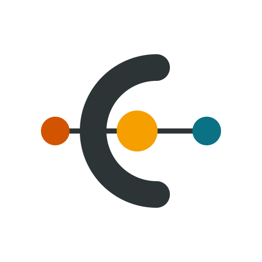
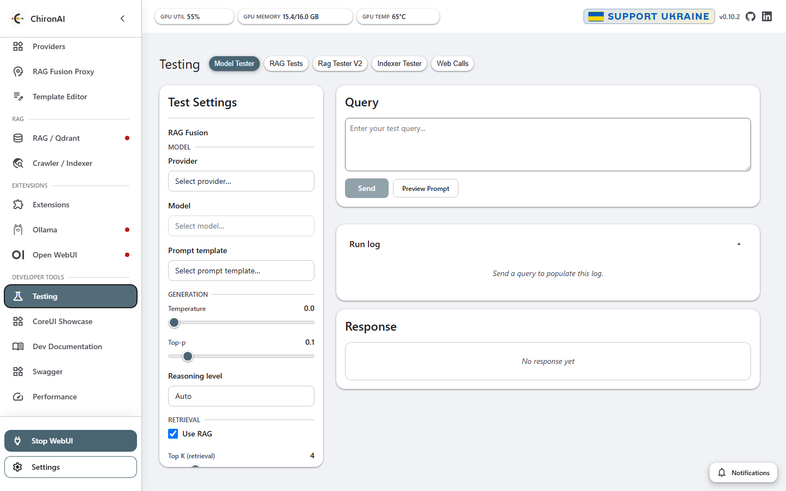
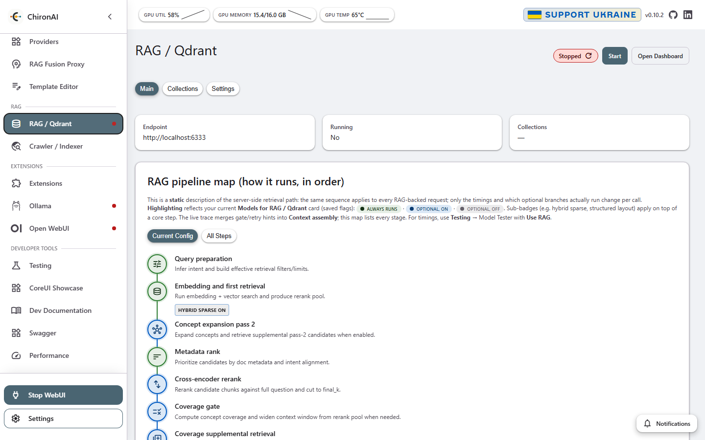
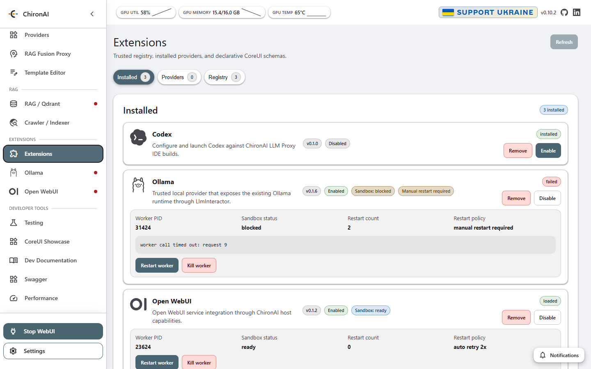
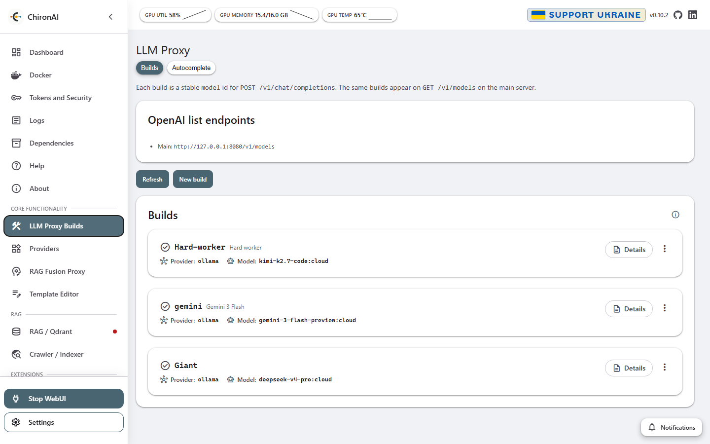

<p align="center">
  
</p>

<h1 align="center">ChironAI</h1>

<p align="center">
  <strong>Local-first RAG you can inspect</strong> — retrieval, rerank, prompts, and providers.<br />
  A transparent platform for developers, not a black-box chatbot.
</p>

<p align="center">
  <a href="LICENSE"></a>
  <a href="https://github.com/Rayllienstery/ChironAI/tags"></a>
  <a href="https://github.com/Rayllienstery/ChironAI/actions"></a>
  <a href="https://codecov.io/gh/Rayllienstery/ChironAI"></a>
</p>

> **Version lines:** Active development is on **0.10.x Pre-Release Stable** (`APP_STAGE = PRE-RELEASE`; current tag **`v0.10.2`**). For production or conservative local use, stay on **`v0.8.63` STABLE** (last STABLE tag before the 0.9+ pre-release line).

## Screenshots

| Chat & grounded answers | Transparent retrieval |
| :---------------------: | :-------------------: |
|  |  |
| Ask questions with retrieval on — inspect the run before you trust the answer. | See the RAG pipeline stages, Qdrant status, and how each step fits together. |

| Extensions & providers | OpenAI-compatible proxy |
| :--------------------: | :---------------------: |
|  |  |
| Install and run isolated providers (Ollama, Open WebUI, and more). | Define stable model builds for `POST /v1/chat/completions`. |

## Why ChironAI?

- **Local-first RAG** with Docker-backed services — your docs stay on your machine.
- **Transparent retrieval** — rerank, prompts, and answer generation you can trace step by step.
- **Extension-based providers** instead of hardcoded Ollama/OpenAI wiring.
- **Quality gates** designed for AI-assisted development and safe refactors.

## What you get

- Crawl and index documentation into Qdrant.
- Ask questions through the WebUI (and CLI).
- Retrieve, optionally rerank, and generate grounded answers.
- Speak OpenAI/Anthropic-compatible proxy APIs; Ollama lives in the bundled `ollama-provider` extension.
- Configure any domain — defaults ship with Apple docs (Swift / iOS / SwiftUI), but sources and prompts are yours to change.

## Quick start

1. Clone the repository and enter it.
2. Copy the example environment file:
   ```bash
   cp .env.example .env
   ```
3. Start Qdrant and Ollama (recommended for local models):
   ```bash
   docker compose up -d qdrant ollama
   ```
4. Install Python packages and dev tools:
   ```bash
   pip install -r requirements-dev.txt
   ```
5. Build the frontend and start the server:
   - **Windows:** `build_and_run.bat`
   - **Manual:** `npm run build` in `CoreModules/CoreUI`, then `start_webui.bat` (Windows) or start the Flask app from the repo root.
6. Open [http://127.0.0.1:8080/webui](http://127.0.0.1:8080/webui).

> **Security note:** ChironAI binds to `127.0.0.1` by default (`server.yaml` / `SERVER_HOST`). The WebUI has no built-in login — any client that can reach the bind address has full management access. Revealing the proxy API key and reading/clearing logs/traces from the LAN requires a 4–8 digit reveal PIN (**Tokens and Security → Remote Access**) and locks out after 3 failed attempts. Do not expose the WebUI to the public internet; use a trusted network or an authenticating reverse proxy. See [`SECURITY.md`](SECURITY.md) and [ADR 0008](docs/adr/0008-webui-auth-model.md).

## Platform support

- **Windows 11 + Docker Desktop** — primary development and release-test environment.
- **Linux / macOS / WSL** — should work via Docker Compose (Debian-based runtime image). CI runs `linux-fast` on Ubuntu and `macos-fast` on macOS. Feedback and PRs for other platforms are welcome.

## Docs & contributing

| Doc | What it’s for |
| --- | --- |
| [`docs/ONBOARDING.md`](docs/ONBOARDING.md) | Fresh checkout → first small PR (Python + CoreUI setup, gates) |
| [`docs/ARCHITECTURE.md`](docs/ARCHITECTURE.md) | Layers, module boundaries, data flow |
| [`docs/CONTRIBUTING.md`](docs/CONTRIBUTING.md) | Branch conventions, commits, quality gates |
| [`docs/QUALITY_GATE_PROFILES.md`](docs/QUALITY_GATE_PROFILES.md) | Local and CI gate profiles |
| [`DEPENDENCIES.md`](DEPENDENCIES.md) | Runtime and tooling dependencies |
| [`SECURITY.md`](SECURITY.md) | Supported versions and private vulnerability reporting |

RAG settings live in [`Core/config/rag.yaml`](Core/config/rag.yaml) (prompt via `rag.prompt` or `RAG_PROMPT`). Bundled prompt defaults are under `Core/modules/prompts_manager/`; runtime edits go to `Core/data/webui/prompts/`.

This is a sanitized public release (prior private history was removed to avoid leaking local traces or sensitive data). The repo is provided as-is as a practical reference for a transparent local RAG platform.

## License

ChironAI is released under the [MIT License](LICENSE).
