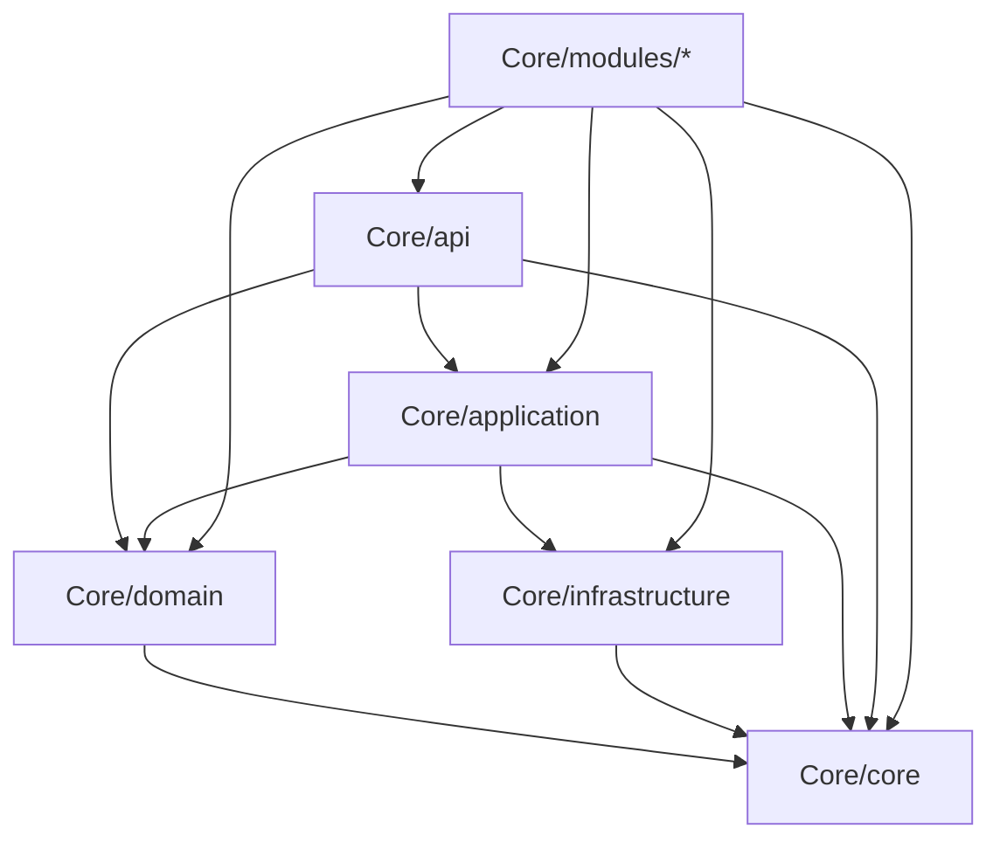
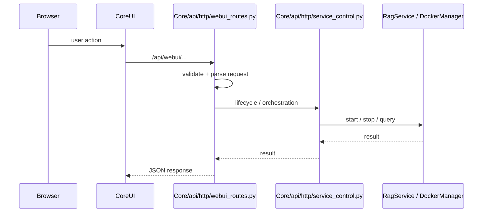
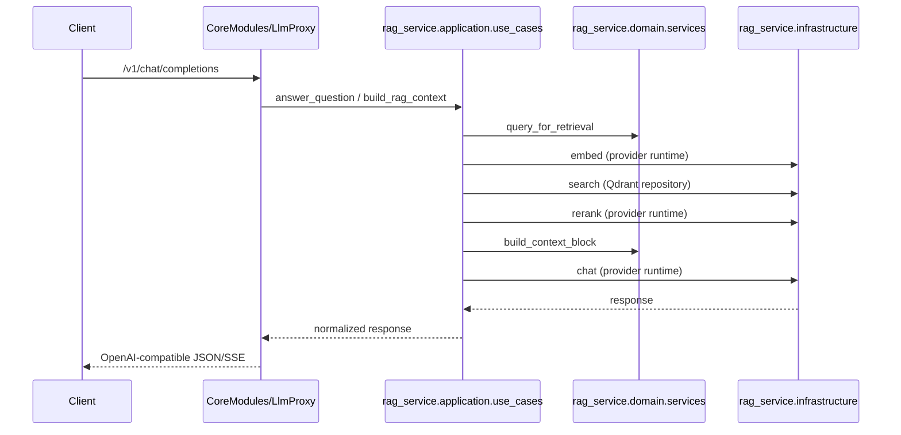

# ChironAI — Layered Architecture

## Status

Accepted. This document is the source of truth for the host structure and module boundaries. For historical context and migration tails, see [`legacy_map.md`](legacy_map.md). For architectural decisions, see [`adr/`](adr/).

## Overview

ChironAI is a modular RAG platform with a Web UI, an OpenAI-compatible LLM proxy, extension management, and crawl/index pipelines. The codebase is organized in layers: **Presentation → Application → Domain → Infrastructure**, with **Config** and **Core** as cross-cutting concerns.

The repository is moving to a **root-clean modular structure**: host-owned runtime code lives under `Core/`, reusable support modules live under `CoreModules/`, extension payloads live under `extensions/`, and the repository root stays free of unowned startup-critical packages. See [`MODULAR_STRUCTURE.md`](MODULAR_STRUCTURE.md) for the target architecture and [`AI_RULES.md`](../AI_RULES.md) for the ownership cheat sheet.

## Repository layout

```text
Core/
  api/            — Presentation (HTTP routes, CLI entrypoints)
  application/    — Application (use cases, container/wiring)
  domain/         — Domain (entities, services, ports, errors)
  infrastructure/ — Infrastructure (Qdrant, FS, crawl, logging)
  config/         — Configuration (YAML + env)
  core/           — Shared contracts/config package; import name `core`
  modules/        — Host-owned services (webui_backend, extensions_backend,
                    crawler_service, external_docs_rag, prompts_manager, …)

CoreModules/      — Reusable core apps/libs (LlmProxy, RagService, CoreUI,
                    DockerManager, MdIngestionService, WebInteraction, …)

extensions/       — Extension payloads (bundled mirrors and marketplace sources)

tests/            — Pytest suites (domain, application, api, infrastructure,
                    CoreModules, scripts, security)

docs/             — Architecture, ADRs, runbooks, legacy map
scripts/          — Quality gates, audits, codegen, migration helpers
```

## Layer rules

The host layers under `Core/` follow strict dependency rules enforced by import-linter:



Rules:

1. `Core/domain/` is the inner layer. It must not import `api`, `application`, or `infrastructure`. This is enforced by import-linter contract `domain_is_inner_layer`.
2. `Core/application/` must not import `api`.
3. `Core/infrastructure/` must not import `api`.
4. Cross-cutting concerns (logging, correlation IDs, settings resolution) live in `Core/core/` and `Core/config/` and are consumed through thin ports, not by reaching across layers.
5. Host-owned services in `Core/modules/` may import any host layer and `CoreModules/*` through their public contracts, but must not import another module's private implementation.

## Data flow

### HTTP / WebUI



### RAG pipeline



### CLI

- `api/cli/crawl_cli.py` (console scripts `tmrag` / `chironai`) delegates to `crawler_service` and `webui_backend` crawl/index workflows.
- `scripts/quality_gate.py` runs the local/CI quality gate.
- `scripts/audit_oversized_files.py` enforces the hard file-size limit.

## Module responsibilities

### Core/api/

- Flask app factory (`create_app`), HTTP blueprints, RESTX namespaces.
- CLI entrypoints (`api/cli/crawl_cli.py`).
- LlmProxy wiring (`Core/api/http/llm_proxy_wiring.py`).
- WebUI route composition (`Core/api/http/webui_routes.py`).
- Service control bridge (`Core/api/http/service_control.py`).

No direct infrastructure imports; uses application use cases and module services.

### Core/application/

- Monolith-boundary helpers under `application/rag/` (for example `proxy_settings_contract`, `collection_freshness`).
- Canonical RAG use cases and composition live in **`rag_service.application`**.
- Default RAG wiring is in **`rag_service.infrastructure.container`**.

### Core/domain/

- Shared non-RAG services (for example `markdown_meta`), ports, and errors.
- RAG entities and services are owned by **`rag_service.domain`**.
- Pure business rules; no Flask, no Qdrant, no Ollama imports.

### Core/infrastructure/

- Qdrant compatibility shims, FS (`MarkdownStore`), crawl (Playwright), logging, metrics, and stack health.
- Ollama provider behavior is owned by the extension/runtime boundary.
- Wire-format compatibility helpers live in `rag_service.infrastructure.openai_*` and LlmProxy modules.

### Core/config/

- Configuration authority: YAML + env resolution.
- Used by all layers through explicit getters.

### Core/core/

- Shared contracts, constants, version, and correlation-ID utilities.
- Import name `core`; may be imported by any layer.

### Core/modules/

Host-owned services:

- `webui_backend` — WebUI business logic, Apple docs extraction, pipeline preview.
- `extensions_backend` — Extension marketplace, install, blocklist, registry.
- `crawler_service` — Crawl orchestration and source management.
- `external_docs_rag` — On-demand external docs RAG flow.
- `prompts_manager` — Prompt template storage and versioning.
- `html_md` — HTML-to-markdown conversion utilities.

### CoreModules/

Reusable modules and applications:

- **`CoreModules/CoreUI`** — React/Vite SPA. Communicates with the host via HTTP. See [`CoreModules/CoreUI/README.md`](../CoreModules/CoreUI/README.md).
- **`CoreModules/LlmProxy`** — OpenAI-compatible `/v1` HTTP surface (`/v1/chat/completions`, `/v1/messages`, `/v1/responses`, `/v1/models`). See [`CoreModules/LlmProxy/README.md`](../CoreModules/LlmProxy/README.md).
- **`CoreModules/RagService`** — Retrieval/RAG engine: embed, search, rerank, context assembly, chat orchestration. See [`CoreModules/RagService/README.md`](../CoreModules/RagService/README.md).
- **`CoreModules/DockerManager`** — Docker host capabilities for extensions and host services. See [`CoreModules/DockerManager/README.md`](../CoreModules/DockerManager/README.md).
- **`CoreModules/MdIngestionService`** — Markdown ingestion, chunking, indexing. See [`CoreModules/MdIngestionService/README.md`](../CoreModules/MdIngestionService/README.md).
- **`CoreModules/WebInteraction`** — Web snippet helpers (DuckDuckGo search, trigger heuristics). See [`CoreModules/WebInteraction/README.md`](../CoreModules/WebInteraction/README.md).
- **`CoreModules/LlmInteractor`** — LLM interactor runtime and extension manager. See [`CoreModules/LlmInteractor/README.md`](../CoreModules/LlmInteractor/README.md).
- **`CoreModules/LogsManager`** — Log aggregation and analytics. See [`CoreModules/LogsManager/README.md`](../CoreModules/LogsManager/README.md).
- **`CoreModules/Security`** — Security utilities and extension audit. See [`CoreModules/Security/README.md`](../CoreModules/Security/README.md).
- **`CoreModules/ExtensionsHost`** — Extension host bridge. See [`CoreModules/ExtensionsHost/README.md`](../CoreModules/ExtensionsHost/README.md).
- **`CoreModules/ExtensionsSandbox`** — Sandboxed extension runtime. See [`CoreModules/ExtensionsSandbox/README.md`](../CoreModules/ExtensionsSandbox/README.md).
- **`CoreModules/ErrorManager`** — Shared error taxonomy. See [`CoreModules/ErrorManager/README.md`](../CoreModules/ErrorManager/README.md).

## High-risk zones

These areas are intentionally fragile and must be changed deliberately:

1. **LlmProxy OpenAI/Anthropic compatibility** — `/v1/chat/completions`, `/v1/messages`, `/v1/responses`, `/v1/models`, tool calls, streaming/SSE, reasoning traces. See ADR 0003.
2. **RAG pipeline orchestration** — `rag_service.application.use_cases`, retrieval flow, rerank, context assembly. Changes affect answer quality and latency.
3. **Extension contracts** — manifest schema, capability enforcement, Docker runtime contract, security audit. See ADR 0002 and ADR 0005.
4. **WebUI API sync** — any change to `/api/webui/*` DTOs must be reflected in CoreUI TypeScript types, API client, and OpenAPI spec.
5. **Docker service control** — container lifecycle, health checks, Qdrant/Ollama/Open WebUI orchestration. See ADR 0005.
6. **Import-linter contracts** — `domain_is_inner_layer` and module isolation. Breaking them reintroduces monolith coupling.

## Service Control Boundary

Service orchestration for WebUI endpoints is routed through `Core/api/http/service_control.py`:

- `Core/api/http/webui_routes.py` stays focused on HTTP composition.
- `Core/api/http/service_control.py` owns the WebUI bridge for Qdrant start/stop and delegates container lifecycle to `rag_service.runtime.RagRuntime`.
- Extension-owned service actions such as Ollama and Open WebUI use DockerManager through `host_context.docker_runtime`.

This keeps lifecycle logic out of large route modules and makes service behavior easier to test and evolve.

## OpenAI Compatibility Policy

`CoreModules/LlmProxy` intentionally supports provider-backed OpenAI/Anthropic chat compatibility. Raw Ollama-compatible routes and legacy `/v1/completions` are not part of the core proxy surface.

- The canonical path remains `/v1/chat/completions`.
- `/v1/messages` and `/v1/responses` normalize to the same provider-backed chat pipeline.
- Wire-format normalization lives in `llm_proxy/wire_format/` and `rag_service.infrastructure.openai_*`.

## Extension System

Extensions are self-contained payloads managed through the extension contracts:

- Each extension root contains `chironai-extension.json` with `id`, `version`, `type`, and `capabilities`.
- The configured backend module exposes `create_provider(host_context, manifest)`.
- Capabilities are enforced at runtime; undeclared capability calls are rejected.
- UI integration is through supported points only: `tab_ui`, `iframe_tab`, `ui_schema`.
- Docker-owned extensions use `host_context.docker_runtime`; direct Docker access is rejected by security audit.

See ADR 0002 and [`docs/EXTENSIONS_GITHUB_MIGRATION.md`](EXTENSIONS_GITHUB_MIGRATION.md).

## Running tests

From project root:

```bash
pip install -r requirements-dev.txt
pytest tests/
```

Configuration lives in **`pyproject.toml`** (`[tool.pytest.ini_options]`), including `pythonpath` entries for `CoreModules/RagService`, `CoreModules/MdIngestionService`, and `Core/modules/crawler_service`.

Coverage report for domain and application:

```bash
pytest tests/ -m fast --cov=domain --cov=application --cov-report=term-missing
```

Domain and application tests use mocks; API tests use Flask test client with wired use cases.

## Quality gates

Local and CI gates are defined in `scripts/quality_gate.py`:

- `minimal` — fast pytest, ruff, version drift, API drift, OpenAPI validation, CoreUI build, knip, lockfile check.
- `full` — minimal + full pytest, oversized file audit, domain/application coverage ≥ 80%.
- `release` — full + startup smoke, Docker build smoke, import-linter.

Run `python scripts/quality_gate.py --profile minimal` before committing.

## Python packaging (monorepo)

The repository root is an installable project **`chironai`** ([`pyproject.toml`](../pyproject.toml)):

- **Editable install**: `pip install -e ".[dev]"` installs host packages from `Core/` and console scripts `tmrag` / `chironai`.
- **`Core/modules/*`**: host-owned service subtrees. They are on `sys.path` for tests via pytest `pythonpath`.
- **`CoreModules/*`**: separate distributions, each with its own `pyproject.toml`.
- **Import boundaries**: [import-linter](https://github.com/seddonym/import-linter) contract `domain_is_inner_layer` forbids `domain` → `application` | `api` | `infrastructure`. Run `lint-imports` after `pip install -r requirements-dev.txt`.

## Adding a new source or model

- **New provider model**: configure provider settings through the provider catalog and extension-owned UI/actions. Ollama-specific service and raw API behavior belongs to `ollama-provider`.
- **Wire-format compatibility**: public `/v1` wire-format normalization lives in `llm_proxy/ollama_compat.py`, `llm_proxy/wire_format/`, and `rag_service.infrastructure.openai_*`. New app code should not add direct Ollama HTTP paths.
- **New crawl source**: add source configuration under the crawler config/source loader used by `crawler_service`; crawl CLI and index flow use it. For a new crawler implementation, implement `CrawlRunner` in `infrastructure/crawl/` and wire it in the application layer.
- **New vector store**: implement `RagRepository` under `rag_service.infrastructure` and wire it in `rag_service.infrastructure.container` instead of `QdrantRagRepository`.
- **New CoreModule**: must have a clear public responsibility, a README, and a documented contract before it can be added. Update `scripts/root_layout_guard.py` if a new top-level directory is required.

## Migration status

- Phase 0 (root ownership allowlist) — complete.
- Phase 1 (host layers under `Core/`) — complete.
- Phase 2 (host services under `Core/modules/`) — complete.
- Phase 3 (prompt templates owned by `prompts_manager`) — complete.
- Phase 4 (extension host bridge and marketplace) — complete.
- Phase 5 (legacy tails documented, Qdrant listing + WebUI retrieval settings moved out of route composition) — in progress; see `docs/legacy_map.md`.

## Observability and health

The host exposes operational endpoints and structured diagnostics:

- `/health` — overall status plus dependency checks (Qdrant, provider runtime, extension runtime).
- `/metrics` — Prometheus-compatible request counts, latencies, and RAG-pipeline step durations.
- JSON-structured logs with `trace_id`, `request_id`, and `module` fields.
- OpenTelemetry spans for RAG-pipeline steps (embed/search/rerank/chat) — advisory.

See T14.1 for the full implementation plan.

## Security posture

Security is enforced at multiple layers:

- **Extension audit** — static scan of extension backend code for subprocess, eval, encoded commands, and unsafe URLs.
- **Capability enforcement** — runtime rejection of undeclared extension capabilities.
- **Docker contract** — extensions must use `host_context.docker_runtime`; direct Docker access is blocked.
- **Dependency scanning** — `pip-audit` and Dependabot alerts.
- **Secret scanning** — GitHub secret scanning + pre-commit hooks.
- **CSP** — Content Security Policy headers for CoreUI.

See T8.1 and T9.1 for the full implementation plan.

## References

- [`AI_RULES.md`](../AI_RULES.md) — ownership cheat sheet and high-risk areas.
- [`docs/adr/`](adr/) — architectural decision records.
- [`docs/legacy_map.md`](legacy_map.md) — intentional legacy tails and their owners.
- [`docs/MODULAR_STRUCTURE.md`](MODULAR_STRUCTURE.md) — target modular structure.
- [`docs/QUALITY_GATE_PROFILES.md`](QUALITY_GATE_PROFILES.md) — gate profiles and drift checks.
- [`docs/EXTENSIONS_GITHUB_MIGRATION.md`](EXTENSIONS_GITHUB_MIGRATION.md) — extension migration guide.
